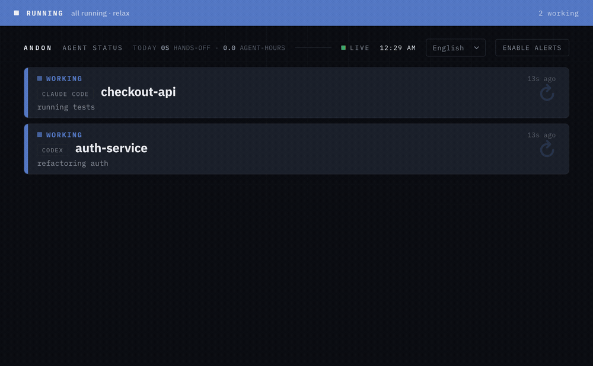
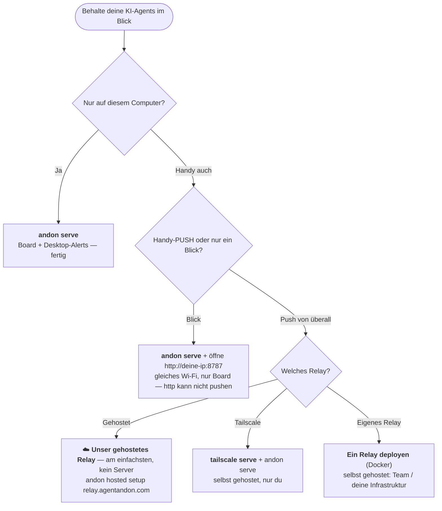

# 🚦 Agent Andon — Statusboard und Benachrichtiger für Claude Code und Codex

**Ein Blick auf irgendeinen Bildschirm — iPad, Handy oder Browser — oder eine Desktop-Benachrichtigung, und du weißt sofort, ob dein KI-Coding-Agent gerade arbeitet, dich braucht, fertig ist oder feststeckt.**

[English](README.md) · [中文](README.zh-CN.md) · [日本語](README.ja.md) · [한국어](README.ko.md) · [Español](README.es.md) · **Deutsch** · [Français](README.fr.md)

[](LICENSE)
[](https://nodejs.org)


**⚡ Schnellster Start** — installieren, mit unserem verwalteten Relay verbinden und vom Handy aus zusehen:

```bash
npm i -g agent-andon
andon hosted setup https://relay.agentandon.com
andon install claude
```
*(danach den Agent neu starten · nur ausprobieren? `npx agent-andon serve --demo`)*

Stell ein altes iPad auf deinen Schreibtisch — oder öffne das Board auf deinem Handy oder in einem beliebigen
Browser. Gib **Claude Code** oder **OpenAI Codex** eine Aufgabe und widme dich dann etwas anderem — ein Blick
genügt, und du weißt, ob der Agent gerade **arbeitet, dich braucht, fertig ist oder feststeckt**. Kein
Babysitten des Terminals, kein Vergessen zurückzukommen.

Es ist ein schlanker, selbst gehosteter Weg, **mehrere KI-Coding-Agents gleichzeitig im Blick zu behalten**
und **in dem Moment benachrichtigt zu werden, in dem einer deine Freigabe braucht, seine Runde beendet oder
blockiert ist** — auf dem Board (jedes Gerät), per Desktop-Banner oder in deiner Menüleiste. Keine App, kein
Konto, null Abhängigkeiten.



> *Andon* (行灯) ist das Signalboard aus der schlanken Fertigung: eine Leuchte, die der ganzen Halle auf einen
> Blick zeigt, ob eine Linie läuft oder einen Menschen braucht. Dieselbe Idee, nur für deine Agents.

- **Null Laufzeitabhängigkeiten** — reine Node.js-Standardbibliothek.
- **Mit einem Befehl verdrahtet** — `andon install claude` passt deine Hooks für dich an (mit Backup).
- **Von Haus aus Multi-Agent** — eine Zeile über die volle Breite pro Session; was dich braucht, wandert nach oben.
- **Spricht deine Sprache** — **English · 中文 · 日本語 · 한국어 · Español · Deutsch · Français**, automatisch erkannt.
- **Jeder Bildschirm** — iPad, Handy oder Browser; keine App, kein Konto, keine Hardware.

---

## Dokumentation

Neu hier? **[Installation](#installation)** → **[Schnellstart](#schnellstart-60-sekunden)** → **[Welches Setup brauchst du?](#welches-setup-brauchst-du)**. Und dann, wenn du tiefer einsteigen willst (die Dokumentation ist auf Englisch):

| Guide | Was drinsteht |
|---|---|
| **[Befehle & Event-Zuordnung](docs/commands.md)** | komplettes CLI · Claude/Codex Event→Status · Zählung von Hintergrundaufgaben · Kacheln benennen |
| **[Benachrichtigungen](docs/notifications.md)** | Desktop-Alerts · Menüleiste · Freigaben feinjustieren |
| **[Betrieb](docs/running.md)** | Board starten / prüfen / stoppen, **Tailscale Serve**, das Relay |
| **[Konfiguration & Sicherheit](docs/configuration.md)** | Umgebungsvariablen · Token-Authentifizierung · Netzwerkmodell |
| **[Gehostetes Board](docs/hosted.md)** · **[Relay deployen](docs/deploy-relay.md)** | das „Board von überall“-Relay — nutz es oder betreib selbst eins |
| **[Fehlerbehebung & FAQ](docs/troubleshooting.md)** · **[Entwicklung](docs/develop.md)** | wenn etwas hakt · Mitwirken |

---

## So funktioniert es

```
Claude Code / Codex  ──(nativer Hook)──▶  andon-Server (dein Computer)  ◀──(SSE-Push)──  iPad / Handy / Browser
```

1. **Erkennen** — der native Hook-Mechanismus jedes Tools meldet Statusänderungen. Keine Änderung an deinem Workflow.
2. **Weiterleiten** — ein winziger HTTP-Server auf deinem Computer empfängt die Events.
3. **Anzeigen** — das Board hält einen offenen SSE-Stream offen, sodass eine Statusänderung in deutlich unter
   einer Sekunde erscheint (es fällt auf 1-Sekunden-Polling zurück). Ein Signalbalken am oberen Rand ist das
   „Signalturmlicht“, quer durch den Raum lesbar.

Status-Priorität (der obere Balken und die Zeilenreihenfolge nehmen den dringendsten an):
`steckt fest (rot) > braucht dich (gelb) > fertig (grün) > arbeitet (blau) > inaktiv`.

**Das Board:** eine Zeile über die volle Breite pro Prozess; **steckt fest / braucht dich** werden groß, zeigen
ihre **vollständige Nachricht** und wandern nach oben (automatisch ins Sichtfeld gescrollt), während
*arbeitet / bereit / inaktiv* kompakt bleiben. Standardmäßig ruhig — nur die einzelne dringendste Zeile pulsiert.
Eine Sprache pro Bildschirm, automatisch erkannt (per Dropdown im Header oder `?lang=` überschreibbar).

---

## Installation

```bash
npm install -g agent-andon      # oder: npx agent-andon serve --demo
```

Aus dem Quellcode:

```bash
git clone https://github.com/tianshanghong/agent-andon && cd agent-andon
npm install && npm run build
node dist/cli.js serve --demo
```

> Erfordert Node.js ≥ 18.

---

## Schnellstart (60 Sekunden)

**1. Prüfe das Board mit Fake-Daten:**

```bash
andon serve --demo
```

Es gibt eine URL der Form `http://<deine-ip>:8787` aus. Öffne sie auf einem beliebigen Handy, Tablet oder im
Browser — du solltest zwei Zeilen sehen, die durch die Farben wechseln. Sobald es passt, `Ctrl-C` und für echt
starten:

```bash
andon serve
```

**2. Öffne das Board** (iPad, Handy oder beliebiger Browser, im selben Wi-Fi wie der Computer):

- Öffne die ausgegebene URL. **Es ist `http://`, nicht `https://`.**
- Tippe einmal auf **„Enable sound“**, um den Ton freizuschalten (Browser stummschalten Audio, bis du tippst;
  das ist der browserinterne Ton des Boards, getrennt von den standardmäßig aktiven Desktop-Alerts). Bleibt über
  Neuladen hinweg gemerkt.
- Auf einem Handy/Tablet: **Zum Home-Bildschirm hinzufügen** für ein Vollbild-Board ohne Adressleiste. (Auf einem
  Wand-iPad zusätzlich **Automatische Sperre → Nie** setzen; die Seite fordert auch einen Wake Lock an.)

**3. Verdrahte deine Agents:**

```bash
andon install claude        # bearbeitet ~/.claude/settings.json (legt ein .andon-backup an)
andon install codex         # bearbeitet ~/.codex/hooks.json    (legt ein .andon-backup an)
andon doctor                # prüft, ob alles verbunden ist; gibt die Board-URL erneut aus
```

Starte deine Claude-Code-Session neu, und sie lässt das Board automatisch aufleuchten. Das war's.

> Du willst das Board (und Handy-Push) von **überall**, nicht nur aus diesem Wi-Fi? → [**Welches Setup brauchst du?**](#welches-setup-brauchst-du)

---

## Welches Setup brauchst du?

`andon serve` gibt dir bereits das Board + **Desktop-Alerts auf dem Computer, der es ausführt** — kostenlos,
ohne Setup, auf **macOS / Linux / Windows**. Aufwendiger ist der **Push aufs Handy**: ein Brummen, wenn ein
Agent dich braucht, *Handy gesperrt, du weg vom Schreibtisch*. Handy-Push braucht ein über **HTTPS** erreichbares
Relay + **„Zum Home-Bildschirm hinzufügen“** auf dem Handy (auf iPhone/iPad erforderlich). **Am einfachsten geht
es über unser gehostetes Relay — nichts zu betreiben, kein Tailscale, kein HTTPS einzurichten.**



| Du willst… | Mach das |
|---|---|
| Board + **Desktop-Alerts** auf deinem Computer | `andon serve` — die Standardvariante *(macOS / Linux / Windows)*, Alerts an |
| Einen Blick aufs Board auf einem **Handy/Tablet im selben Wi-Fi** | `andon serve`, öffne `http://<deine-ip>:8787` — *nur Board; `http` kann nicht pushen* |
| **📱 Handy-Push — der einfache Weg** *(kein Server, kein Tailscale)* | **☁️ unser gehostetes Relay:** `andon hosted setup https://relay.agentandon.com` + Zum Home-Bildschirm hinzufügen — *kommt bald, [⭐ beobachten](https://github.com/tianshanghong/agent-andon)* |
| Handy-Push, **selbst gehostet — nur du** | [`tailscale serve`](docs/running.md) + `andon serve` + Zum Home-Bildschirm hinzufügen |
| Handy-Push, **dein eigenes Relay** (Team / deine Infrastruktur) | [ein Relay deployen](docs/deploy-relay.md) (Docker) + Zum Home-Bildschirm hinzufügen |

**Faustregel:** `andon serve` gibt dir überall kostenlose **Desktop**-Alerts. Du willst sie auf deinem **Handy**?
— am einfachsten über unser **gehostetes Relay** (nichts zu betreiben); oder selbst gehostet mit **Tailscale**
(nur du) oder deinem **eigenen Relay** (ein Team).

---

## Befehle

```bash
andon serve                 # das Board starten (Desktop-Alerts standardmäßig an)
andon install claude        # Claude-Code-Hooks verdrahten (auch: install codex)
andon doctor                # Health-Check + die Board-URL
andon post <state> <agent>  # einen Status von Hand senden
andon uninstall claude      # sauber entfernen, was Andon hinzugefügt hat
```

Die vollständige Referenz — jedes Flag, die **Event → Status**-Zuordnung für Claude/Codex, die Zählung von
Hintergrundaufgaben und das Benennen von Kacheln — steht in **[docs/commands.md](docs/commands.md)**.

---

## Benachrichtigungen

Desktop-Alerts sind **standardmäßig an** — ein Banner (und Ton bei braucht-dich / steckt-fest) auf dem Computer,
der den Server ausführt, mit sauberer Degradierung über macOS / Linux / Windows; dazu eine Zusammenfassung in der
Menüleiste. Justiere sie mit `--say` / `--no-notify`, oder gib sichere Operationen vorab frei, damit Gelb
seltener auslöst. Siehe **[docs/notifications.md](docs/notifications.md)**.

---

## Betrieb (Start / Stopp)

```bash
andon serve                                  # Vordergrund — Ctrl-C zum Stoppen
nohup andon serve > /tmp/andon.log 2>&1 &    # Hintergrund (macOS / Linux)
pkill -f "cli.js serve"                      # eine Hintergrund-Instanz stoppen
```

Vollständiges Starten / Prüfen / Stoppen des Boards, **Tailscale Serve** und des Relays: **[docs/running.md](docs/running.md)**.

---

## Gehostet („Board von überall“)

Andon ist local-first und **für immer kostenlos selbst zu hosten** — das bleibt der Standard. Das optionale,
**aktiv zu aktivierende** Relay gibt dir das Board + Handy-Push von überall — nutze **unser gehostetes Relay**
(null Setup) oder **betreib dein eigenes** (derselbe Open-Source-Code):

```bash
andon hosted setup https://relay.agentandon.com   # aktivieren — es wird ein Schlüssel erzeugt, der deine Maschine nie verlässt
andon relay                                        # …oder das inhaltsblinde Relay selbst betreiben
andon verify <relay-url>                           # prüfen, ob ein Relay genau den Open-Source-Code ausliefert
```

Der **Inhalt** jedes Status (Titel, Nachricht und Agent-Name) wird **auf deinem Rechner Ende-zu-Ende-verschlüsselt**,
bevor er ihn verlässt; das Relay leitet und speichert nur **diesen Chiffretext, den es nicht entschlüsseln kann** (es
erhält deinen Schlüssel nie) — es kann deine Prompts, deinen Code, deine Titel oder Nachrichten also nicht lesen. Es
sieht nur grobe Metadaten: dass du aktiv bist, ungefähr wann, den groben Status und deine IP. *„Überprüfbar, nicht bloß
vertraut“:* der ausgelieferte Code ist Open Source + reproduzierbar, und `andon verify` bestätigt, dass ein Relay
genau diesen ausliefert. Vollständige Guides: **[das gehostete Board nutzen](docs/hosted.md)** ·
**[ein Relay deployen](docs/deploy-relay.md)**.

> **Du willst nichts betreiben?** Unser gehostetes Relay unter `relay.agentandon.com` ist der Weg ohne Setup —
> es **startet bald**; **⭐ star / watch**, um den Go-live mitzubekommen.

---

## Sicherheit

Standardmäßig bindet sich der Server an `0.0.0.0` mit **ohne Authentifizierung** — in Ordnung im
vertrauenswürdigen Heim-Wi-Fi, **nicht** in einem öffentlichen/nicht vertrauenswürdigen Netzwerk. Setze
`ANDON_TOKEN` für ein geteiltes Netzwerk und richte kein Port-Forwarding ein (nutze die HTTPS-Wege oben). Das
Board legt nur den groben Status offen — niemals Code oder Logs. Details + Umgebungsvariablen:
**[docs/configuration.md](docs/configuration.md)**.

---

## Lizenz

[AGPL-3.0-or-later](LICENSE) — © 2026 wwang.

Du darfst Andon frei ausführen, selbst hosten, prüfen, forken und verändern. Wenn du eine **veränderte** Version
als Netzwerkdienst betreibst, verlangt AGPL §13, dass du deinen Nutzern deren Quellcode anbietest; betreibst du
sie unverändert (ein Wandboard, das mit deinen eigenen Agents spricht), trifft dich diese Pflicht nicht. Der
Maintainer bietet Andon zusätzlich unter separaten kommerziellen Bedingungen für einen gehosteten Dienst an —
siehe [CONTRIBUTING](CONTRIBUTING.md) dazu, wie das möglich bleibt.

Der Name **„Andon“ / „Agent Andon“** und das Logo sind geschützte Marken des Autors — die Lizenz deckt den Code
ab, nicht den Namen (siehe [TRADEMARK](TRADEMARK.md)). Forks müssen einen anderen Namen verwenden.
