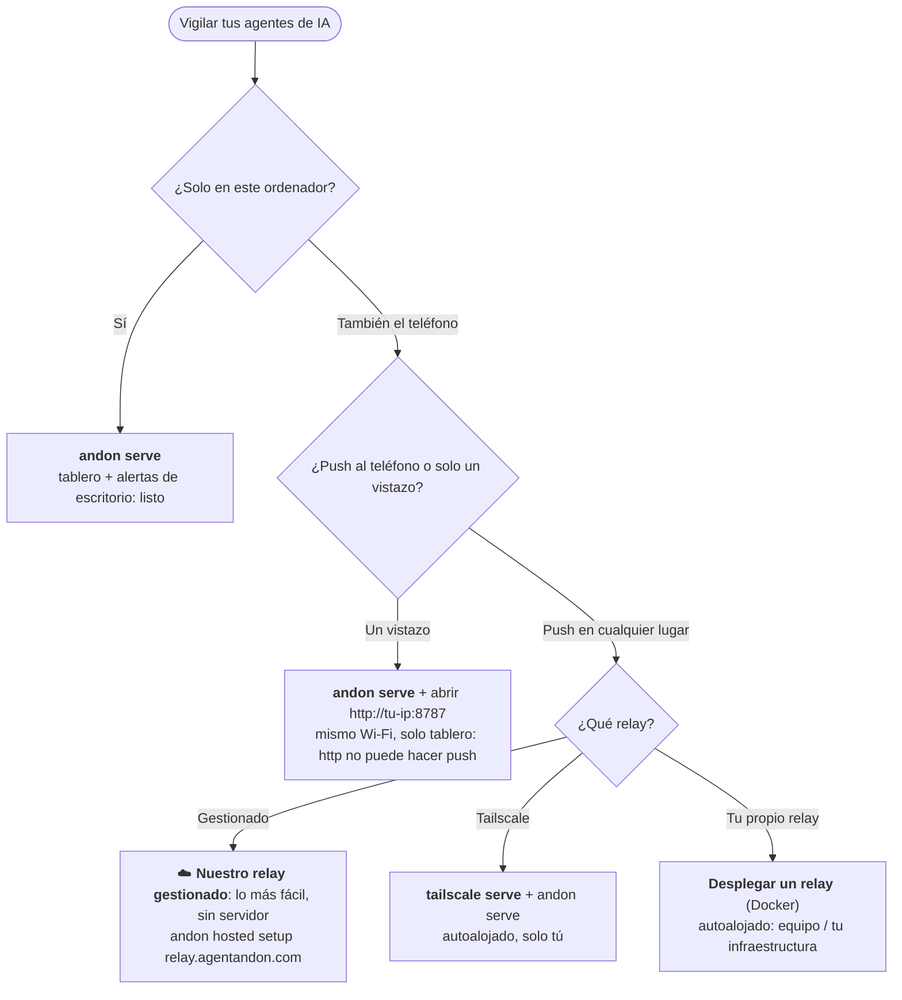

# 🚦 Agent Andon — un tablero de estado y notificador para Claude Code y Codex

**Echa un vistazo a cualquier pantalla —iPad, teléfono o navegador— o recibe una alerta en el escritorio en el momento en que tu agente de programación con IA está trabajando, te necesita, ha terminado o se ha quedado atascado.**

[English](README.md) · [中文](README.zh-CN.md) · [日本語](README.ja.md) · [한국어](README.ko.md) · **Español** · [Deutsch](README.de.md) · [Français](README.fr.md)

[](LICENSE)
[](https://nodejs.org)


Coloca un iPad viejo sobre tu escritorio —o abre el tablero en tu teléfono o en cualquier
navegador—. Encárgale una tarea a **Claude Code** o a **OpenAI Codex** y ponte a hacer otra cosa:
un solo vistazo te dice si el agente está **trabajando, te necesita, ha terminado o se ha
atascado**. Sin estar pendiente del terminal y sin olvidarte de volver.

Es una forma ligera y autoalojada de **vigilar varios agentes de programación con IA a la vez** y
**recibir un aviso en el instante en que uno necesita tu aprobación, termina su turno o se queda
bloqueado**: en el tablero (cualquier dispositivo), en una notificación del escritorio o en la barra
de menús. Sin app, sin cuenta, cero dependencias.


> El *andon* (行灯) es el tablero de señalización de la fabricación lean: una luz que le indica a
> toda la planta, de un vistazo, si una línea está en marcha o necesita a una persona. La misma
> idea, pero para tus agentes.

- **Cero dependencias en tiempo de ejecución** — solo la biblioteca estándar de Node.js.
- **Una sola orden para dejarlo todo listo** — `andon install claude` edita tus hooks por ti (con una copia de seguridad).
- **Pensado para varios agentes** — una fila a todo lo ancho por sesión; el que te necesita sube arriba del todo.
- **Habla tu idioma** — **English · 中文 · 日本語 · 한국어 · Español · Deutsch · Français**, detectado automáticamente.
- **Cualquier pantalla** — iPad, teléfono o navegador; sin app, sin cuenta, sin hardware.

---

## Documentación

¿Es tu primera vez? **[Instalación](#instalación)** → **[Inicio rápido](#inicio-rápido-60-segundos)** → **[¿Qué configuración necesitas?](#qué-configuración-necesitas)**. Después, para profundizar (la documentación está en inglés):

| Guía | Qué contiene |
|---|---|
| **[Comandos y mapeo de eventos](docs/commands.md)** | CLI completa · evento de Claude/Codex → estado · recuento de tareas en segundo plano · nombrar tarjetas |
| **[Notificaciones](docs/notifications.md)** | alertas de escritorio · barra de menús · ajustar las aprobaciones |
| **[Ejecutarlo](docs/running.md)** | iniciar / comprobar / detener el tablero, **Tailscale Serve**, el relay |
| **[Configuración y seguridad](docs/configuration.md)** | variables de entorno · autenticación por token · modelo de red |
| **[Tablero alojado](docs/hosted.md)** · **[Desplegar un relay](docs/deploy-relay.md)** | el relay del «tablero desde cualquier lugar»: úsalo o monta uno |
| **[Resolución de problemas y FAQ](docs/troubleshooting.md)** · **[Desarrollo](docs/develop.md)** | cuando algo va mal · cómo contribuir |

---

## Cómo funciona

```
Claude Code / Codex  ──(hook nativo)──▶  servidor andon (tu ordenador)  ◀──(push SSE)──  iPad / teléfono / navegador
```

1. **Detectar** — el mecanismo de hooks nativo de cada herramienta informa de los cambios de estado. Sin cambios en tu flujo de trabajo.
2. **Retransmitir** — un pequeño servidor HTTP en tu ordenador recibe los eventos.
3. **Mostrar** — el tablero mantiene abierto un flujo SSE, así que un cambio de estado se ve en bastante menos de un segundo (y recurre a un sondeo cada 1 s como respaldo). La barra de señalización superior es la «torre de luces», legible desde el otro lado de la sala.

Prioridad de estados (la barra superior y el orden de las filas toman el más urgente):
`atascado (rojo) > te necesita (ámbar) > terminado (verde) > trabajando (azul) > inactivo`.

**El tablero:** una fila a todo lo ancho por proceso; **atascado / te necesita** se agrandan,
muestran su **mensaje completo** y suben arriba del todo (con desplazamiento automático para que se
vean), mientras que *trabajando / listo / inactivo* se mantienen compactos. Tranquilo por defecto:
solo parpadea la única fila más urgente. Un idioma por pantalla, detectado automáticamente (se puede
forzar con el menú desplegable de la cabecera o con `?lang=`).

---

## Instalación

```bash
npm install -g agent-andon      # o: npx agent-andon serve --demo
```

Desde el código fuente:

```bash
git clone https://github.com/tianshanghong/agent-andon && cd agent-andon
npm install && npm run build
node dist/cli.js serve --demo
```

> Requiere Node.js ≥ 18.

---

## Inicio rápido (60 segundos)

**1. Comprueba el tablero con datos de prueba:**

```bash
andon serve --demo
```

Imprime una URL `http://<tu-ip>:8787`. Ábrela en cualquier teléfono, tablet o navegador: deberías
ver dos filas cambiando de color en bucle. Cuando se vea bien, pulsa `Ctrl-C` y ejecútalo de verdad:

```bash
andon serve
```

**2. Abre el tablero** (iPad, teléfono o cualquier navegador, en el mismo Wi-Fi que el ordenador):

- Abre la URL impresa. **Es `http://`, no `https://`.**
- Toca **«Enable sound»** una vez para desbloquear el sonido (los navegadores silencian el audio
  hasta que tocas la pantalla; este es el sonido propio del tablero, distinto de las alertas de
  escritorio, que vienen activadas). Se recuerda entre recargas.
- En un teléfono/tablet: **Añadir a la pantalla de inicio** para tener un tablero a pantalla
  completa y sin barra de direcciones. (En un iPad de pared, pon además **Bloqueo automático →
  Nunca**; la página también solicita un Wake Lock.)

**3. Conecta tus agentes:**

```bash
andon install claude        # edita ~/.claude/settings.json (conserva un .andon-backup)
andon install codex         # edita ~/.codex/hooks.json    (conserva un .andon-backup)
andon doctor                # confirma que todo está conectado; reimprime la URL del tablero
```

Reinicia tu sesión de Claude Code y encenderá el tablero automáticamente. Eso es todo.

> ¿Quieres el tablero (y las notificaciones push al teléfono) desde **cualquier lugar**, no solo en este Wi-Fi? → [**¿Qué configuración necesitas?**](#qué-configuración-necesitas)

---

## ¿Qué configuración necesitas?

`andon serve` ya te da el tablero + **alertas de escritorio en el ordenador que lo ejecuta**: gratis,
sin configuración y en **macOS / Linux / Windows**. Lo que cuesta un poco más es el **push a tu
teléfono**: una vibración cuando un agente te necesita, *con el teléfono bloqueado y tú lejos del
escritorio*. El push al teléfono necesita un relay accesible por **HTTPS** + **«Añadir a la pantalla
de inicio»** en el teléfono (obligatorio en iPhone/iPad). **Lo más fácil es nuestro relay
gestionado: nada que ejecutar, sin Tailscale, sin HTTPS que configurar.**



| Quieres… | Haz esto |
|---|---|
| Tablero + **alertas de escritorio** en tu ordenador | `andon serve` — el modo por defecto *(macOS / Linux / Windows)*, con alertas activadas |
| Echar un vistazo al tablero en un **teléfono/tablet del mismo Wi-Fi** | `andon serve`, abrir `http://<tu-ip>:8787` — *solo tablero; `http` no puede hacer push* |
| **📱 Push al teléfono — la vía fácil** *(sin servidor, sin Tailscale)* | **☁️ nuestro relay gestionado:** `andon hosted setup https://relay.agentandon.com` + Añadir a la pantalla de inicio — *próximamente, [⭐ síguelo](https://github.com/tianshanghong/agent-andon)* |
| Push al teléfono, **autoalojado — solo tú** | [`tailscale serve`](docs/running.md) + `andon serve` + Añadir a la pantalla de inicio |
| Push al teléfono, **tu propio relay** (equipo / tu infraestructura) | [desplegar un relay](docs/deploy-relay.md) (Docker) + Añadir a la pantalla de inicio |

**Regla general:** `andon serve` te da alertas de **escritorio** gratis, en cualquier sitio. ¿Las
quieres en el **teléfono**? Lo más fácil es nuestro **relay gestionado** (nada que ejecutar); o
autoalójalo con **Tailscale** (solo tú) o con **tu propio relay** (un equipo).

---

## Comandos

```bash
andon serve                 # ejecutar el tablero (alertas de escritorio activadas por defecto)
andon install claude        # conectar los hooks de Claude Code (también: install codex)
andon doctor                # comprobación de estado + URL del tablero
andon post <state> <agent>  # enviar un estado a mano
andon uninstall claude      # eliminar limpiamente lo que añadió Andon
```

La referencia completa —cada opción, el mapeo **evento → estado** de Claude/Codex, el recuento de
tareas en segundo plano y el nombrado de tarjetas— está en **[docs/commands.md](docs/commands.md)**
(en inglés).

---

## Notificaciones

Las alertas de escritorio vienen **activadas por defecto**: una notificación (y sonido para «te
necesita» / «atascado») en el ordenador que ejecuta el servidor, degradándose con elegancia en
macOS / Linux / Windows; también hay un resumen en la barra de menús. Ajústalas con `--say` /
`--no-notify`, o preaprueba las operaciones seguras para que el ámbar salte menos. Consulta
**[docs/notifications.md](docs/notifications.md)** (en inglés).

---

## Ejecutarlo (iniciar / detener)

```bash
andon serve                                  # primer plano — Ctrl-C para detener
nohup andon serve > /tmp/andon.log 2>&1 &    # segundo plano (macOS / Linux)
pkill -f "cli.js serve"                      # detener una instancia en segundo plano
```

Todo el detalle para iniciar / comprobar / detener el tablero, **Tailscale Serve** y el relay: **[docs/running.md](docs/running.md)** (en inglés).

---

## Alojado («el tablero desde cualquier lugar»)

Andon es local primero y **gratis para autoalojar siempre**: eso sigue siendo lo predeterminado. El
relay opcional, que **activas tú**, te da el tablero + push al teléfono desde cualquier lugar: usa
**nuestro relay gestionado** (sin configuración) o **monta el tuyo** (el mismo código abierto):

```bash
andon hosted setup https://relay.agentandon.com   # actívalo — se genera una clave que nunca sale de tu máquina
andon relay                                        # …o ejecuta tú mismo el relay de conocimiento cero
andon verify <relay-url>                           # comprueba que un relay sirve exactamente el código abierto
```

Cada estado se **cifra de extremo a extremo en tu máquina** antes de salir; el relay enruta y
almacena **solo texto cifrado** y no puede leer tus prompts, tu código, tus títulos ni tus mensajes:
solo ve que estás activo, más o menos cuándo y tu IP. *«Verificable, no solo de fiar»:* el código
servido es abierto y reproducible, y `andon verify` confirma que un relay sirve exactamente ese.
Guías completas: **[usar el tablero alojado](docs/hosted.md)** · **[desplegar un relay](docs/deploy-relay.md)** (en inglés).

> **¿No quieres ejecutar nada?** Nuestro relay gestionado en `relay.agentandon.com` es la vía sin
> configuración: está **a punto de lanzarse**; **⭐ dale una estrella / síguelo** para enterarte en
> cuanto esté disponible.

---

## Seguridad

Por defecto, el servidor escucha en `0.0.0.0` **sin autenticación**: está bien en un Wi-Fi
doméstico de confianza, pero **no** en una red pública o no confiable. Define `ANDON_TOKEN` para una
red compartida y no lo expongas con port-forwarding (usa las vías HTTPS de arriba). El tablero solo
expone estado de alto nivel, nunca código ni registros. Detalles + variables de entorno:
**[docs/configuration.md](docs/configuration.md)** (en inglés).

---

## Licencia

[AGPL-3.0-or-later](LICENSE) — © 2026 wwang.

Ejecuta, autoaloja, audita, bifurca (fork) y modifica Andon con total libertad. Si ejecutas una
versión **modificada** como servicio de red, el artículo 13 de la AGPL te pide que ofrezcas su
código fuente a tus usuarios; ejecutarlo sin modificar (un tablero de pared hablando con tus propios
agentes) no conlleva esa obligación. El mantenedor también ofrece Andon bajo condiciones comerciales
aparte para un servicio alojado; consulta [CONTRIBUTING](CONTRIBUTING.md) para ver cómo eso sigue
siendo posible.

El nombre **«Andon» / «Agent Andon»** y el logotipo son marcas reservadas del autor: la licencia
cubre el código, no el nombre (consulta [TRADEMARK](TRADEMARK.md)). Los forks deben usar un nombre
distinto.
