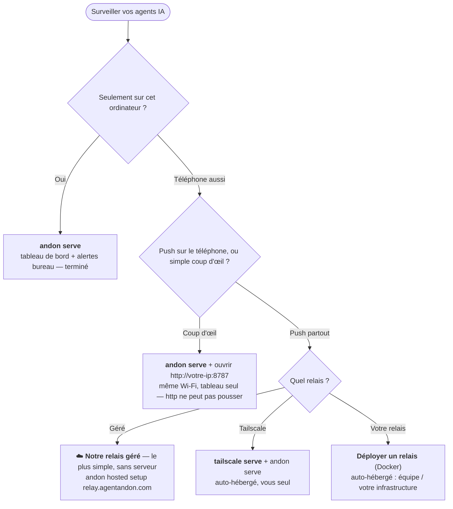

# 🚦 Agent Andon — un tableau de bord et notificateur pour Claude Code et Codex

**Jetez un œil à n'importe quel écran — iPad, téléphone ou navigateur — ou recevez une alerte sur votre bureau — dès l'instant où votre agent de code IA travaille, a besoin de vous, a terminé, ou est bloqué.**

[English](README.md) · [中文](README.zh-CN.md) · [日本語](README.ja.md) · [한국어](README.ko.md) · [Español](README.es.md) · [Deutsch](README.de.md) · **Français**

[](LICENSE)
[](https://nodejs.org)


**⚡ Démarrage le plus rapide** — trois commandes et vous suivez vos agents depuis votre téléphone, où que vous soyez. Le relais ne traite que du texte chiffré qu'il ne peut pas lire ; votre code reste chez vous :

```bash
npm i -g agent-andon
andon hosted setup https://relay.agentandon.com
andon install claude
```
*(puis redémarrez votre agent · juste pour essayer ? `npx agent-andon serve --demo`)*

Posez un vieil iPad sur votre bureau — ou ouvrez le tableau de bord sur votre téléphone ou dans
n'importe quel navigateur. Confiez une tâche à **Claude Code** ou **OpenAI Codex**, puis passez à
autre chose : un coup d'œil suffit pour savoir si l'agent **travaille, a besoin de vous, a terminé,
ou est bloqué**. Fini de surveiller le terminal, fini d'oublier d'y revenir.

C'est une façon légère et auto-hébergée de **surveiller plusieurs agents de code IA à la fois** et
de **recevoir une notification dès que l'un d'eux attend votre approbation, termine son tour, ou se
retrouve bloqué** — sur le tableau de bord (n'importe quel appareil), via une bannière sur le
bureau, ou dans la barre de menus. Aucune application, aucun compte, zéro dépendance.


> L'*andon* (行灯) est le tableau de signalisation de la production allégée (lean) : une lampe qui
> indique à tout l'atelier, d'un seul coup d'œil, si une ligne tourne ou réclame une intervention
> humaine. Même idée, pour vos agents.

- **Zéro dépendance d'exécution** — uniquement la bibliothèque standard de Node.js.
- **Une seule commande pour tout brancher** — `andon install claude` modifie vos hooks à votre place (avec une sauvegarde).
- **Pensé pour le multi-agent** — une ligne pleine largeur par session ; celui qui a besoin de vous remonte en haut.
- **Parle votre langue** — **English · 中文 · 日本語 · 한국어 · Español · Deutsch · Français**, détecté automatiquement.
- **N'importe quel écran** — iPad, téléphone ou navigateur ; aucune application, aucun compte, aucun matériel.

---

## Documentation

Vous débutez ? **[Installation](#installation)** → **[Démarrage rapide](#démarrage-rapide-60-secondes)** → **[Quelle configuration vous faut-il ?](#quelle-configuration-vous-faut-il)**. Ensuite, pour aller plus loin (la documentation est en anglais) :

| Guide | Contenu |
|---|---|
| **[Commandes et correspondance des événements](docs/commands.md)** | CLI complète · événement Claude/Codex → état · comptage des tâches en arrière-plan · nommage des tuiles |
| **[Notifications](docs/notifications.md)** | alertes sur le bureau · barre de menus · réglage des approbations |
| **[L'exécuter](docs/running.md)** | démarrer / vérifier / arrêter le tableau de bord, **Tailscale Serve**, le relais |
| **[Configuration et sécurité](docs/configuration.md)** | variables d'environnement · authentification par jeton · modèle réseau |
| **[Tableau de bord hébergé](docs/hosted.md)** · **[Déployer un relais](docs/deploy-relay.md)** | le relais « tableau de bord où que vous soyez » — l'utiliser, ou en faire tourner un |
| **[Dépannage et FAQ](docs/troubleshooting.md)** · **[Développement](docs/develop.md)** | quand quelque chose cloche · comment contribuer |

---

## Fonctionnement

```
Claude Code / Codex  ──(hook natif)──▶  serveur andon (votre ordinateur)  ◀──(push SSE)──  iPad / téléphone / navigateur
```

1. **Détection** — le mécanisme de hook natif de chaque outil signale les changements d'état. Aucun changement dans votre façon de travailler.
2. **Relais** — un petit serveur HTTP sur votre ordinateur reçoit les événements.
3. **Affichage** — le tableau de bord maintient un flux SSE ouvert, si bien qu'un changement d'état apparaît en bien moins d'une seconde (avec repli sur un sondage toutes les 1 s). La barre de signalisation en haut joue le rôle de « gyrophare », lisible à l'autre bout de la pièce.

Priorité des états (la barre du haut et l'ordre des lignes retiennent le plus urgent) :
`bloqué (rouge) > a besoin de vous (ambre) > terminé (vert) > en cours (bleu) > inactif`.

**Le tableau de bord :** une ligne pleine largeur par processus ; **bloqué / a besoin de vous**
grandissent, affichent leur **message complet** et remontent en haut (avec défilement automatique
pour les rendre visibles), tandis que *en cours / prêt / inactif* restent compacts. Calme par
défaut — seule la ligne la plus urgente pulse. Une langue par écran, détectée automatiquement
(modifiable via le menu déroulant de l'en-tête ou `?lang=`).

---

## Installation

```bash
npm install -g agent-andon      # ou : npx agent-andon serve --demo
```

Depuis les sources :

```bash
git clone https://github.com/tianshanghong/agent-andon && cd agent-andon
npm install && npm run build
node dist/cli.js serve --demo
```

> Nécessite Node.js ≥ 18.

---

## Démarrage rapide (60 secondes)

**1. Vérifiez le tableau de bord avec des données fictives :**

```bash
andon serve --demo
```

Il affiche une URL `http://<votre-ip>:8787`. Ouvrez-la sur n'importe quel téléphone, tablette ou
navigateur — vous devriez voir deux lignes changer de couleur en boucle. Une fois que tout semble
correct, faites `Ctrl-C` et lancez la version réelle :

```bash
andon serve
```

**2. Ouvrez le tableau de bord** (iPad, téléphone ou n'importe quel navigateur, sur le même Wi-Fi que l'ordinateur) :

- Ouvrez l'URL affichée. **C'est `http://`, pas `https://`.**
- Touchez une fois **« Enable sound »** pour débloquer le carillon (les navigateurs coupent le son
  tant que vous n'avez pas touché l'écran ; il s'agit du son intégré au tableau de bord, distinct
  des alertes sur le bureau activées par défaut). Mémorisé d'un rechargement à l'autre.
- Sur un téléphone/une tablette : **Ajouter à l'écran d'accueil** pour un tableau de bord en plein
  écran, sans barre d'adresse. (Sur un iPad fixé au mur, réglez aussi **Verrouillage automatique →
  Jamais** ; la page demande également un Wake Lock.)

**3. Branchez vos agents :**

```bash
andon install claude        # modifie ~/.claude/settings.json (conserve un .andon-backup)
andon install codex         # modifie ~/.codex/hooks.json    (conserve un .andon-backup)
andon doctor                # vérifie que tout est connecté ; réaffiche l'URL du tableau de bord
```

Redémarrez votre session Claude Code et elle allume le tableau de bord automatiquement. C'est tout.

> Vous voulez le tableau de bord (et les notifications push sur le téléphone) **où que vous soyez**, pas seulement sur ce Wi-Fi ? → [**Quelle configuration vous faut-il ?**](#quelle-configuration-vous-faut-il)

---

## Quelle configuration vous faut-il ?

### 🔧 Plutôt auto-héberger ?

Lancez tout le tableau en local avec `andon serve` (gratuit, alertes bureau, sans relais), ou hébergez votre propre relais avec `andon relay` (`andon verify <url>` vérifie n'importe quel relais). → [guide d'auto-hébergement complet](docs/deploy-relay.md)

`andon serve` vous donne déjà le tableau de bord + **les alertes sur le bureau de l'ordinateur qui
l'exécute** — gratuit, sans configuration, sur **macOS / Linux / Windows**. Ce qui demande un peu
plus d'efforts, c'est le **push vers votre téléphone** : une vibration quand un agent a besoin de
vous, *téléphone verrouillé, vous loin du bureau*. Le push sur téléphone nécessite un relais
accessible via **HTTPS** + **« Ajouter à l'écran d'accueil »** sur le téléphone (obligatoire sur
iPhone/iPad). **Le plus simple, c'est notre relais géré — rien à faire tourner, pas de Tailscale,
pas de HTTPS à configurer.**



| Vous voulez… | Faites ceci |
|---|---|
| Tableau de bord + **alertes sur le bureau** de votre ordinateur | `andon serve` — le mode par défaut *(macOS / Linux / Windows)*, alertes activées |
| Jeter un œil au tableau de bord sur un **téléphone/une tablette du même Wi-Fi** | `andon serve`, ouvrir `http://<votre-ip>:8787` — *tableau seul ; `http` ne peut pas pousser* |
| **📱 Push sur le téléphone — la voie facile** *(sans serveur, sans Tailscale)* | **☁️ notre relais géré :** `andon hosted setup https://relay.agentandon.com` + Ajouter à l'écran d'accueil — *en cours de lancement, [⭐ à suivre](https://github.com/tianshanghong/agent-andon)* |
| Push sur le téléphone, **auto-hébergé — vous seul** | [`tailscale serve`](docs/running.md) + `andon serve` + Ajouter à l'écran d'accueil |
| Push sur le téléphone, **votre propre relais** (équipe / votre infra) | [déployer un relais](docs/deploy-relay.md) (Docker) + Ajouter à l'écran d'accueil |

**Règle générale :** `andon serve` vous donne gratuitement des alertes sur le **bureau**, partout.
Vous les voulez sur votre **téléphone** ? — le plus simple est notre **relais géré** (rien à faire
tourner) ; sinon, auto-hébergez avec **Tailscale** (vous seul) ou **votre propre relais** (une
équipe).

---

## Commandes

```bash
andon serve                 # lancer le tableau de bord (alertes bureau activées par défaut)
andon install claude        # brancher les hooks de Claude Code (aussi : install codex)
andon doctor                # bilan de santé + URL du tableau de bord
andon post <state> <agent>  # pousser un état à la main
andon uninstall claude      # retirer proprement ce qu'Andon a ajouté
```

La référence complète — chaque option, la correspondance **événement → état** de Claude/Codex, le
comptage des tâches en arrière-plan et le nommage des tuiles — se trouve dans
**[docs/commands.md](docs/commands.md)** (en anglais).

---

## Notifications

Les alertes sur le bureau sont **activées par défaut** — une bannière (et un son pour « a besoin de
vous » / « bloqué ») sur l'ordinateur qui exécute le serveur, avec une dégradation élégante sur
macOS / Linux / Windows ; il y a aussi un résumé dans la barre de menus. Ajustez-les avec `--say` /
`--no-notify`, ou pré-approuvez les opérations sûres pour que l'ambre se déclenche moins souvent.
Voir **[docs/notifications.md](docs/notifications.md)** (en anglais).

---

## L'exécuter (démarrer / arrêter)

```bash
andon serve                                  # premier plan — Ctrl-C pour arrêter
nohup andon serve > /tmp/andon.log 2>&1 &    # arrière-plan (macOS / Linux)
pkill -f "cli.js serve"                      # arrêter une instance en arrière-plan
```

Le détail complet pour démarrer / vérifier / arrêter le tableau de bord, **Tailscale Serve** et le relais : **[docs/running.md](docs/running.md)** (en anglais).

---

## Hébergé (« tableau de bord où que vous soyez »)

Andon est local d'abord et **gratuit à auto-héberger pour toujours** — cela reste le mode par
défaut. Le relais optionnel, **activé sur demande**, vous donne le tableau de bord + le push sur le
téléphone où que vous soyez — utilisez **notre relais géré** (zéro configuration) ou **faites tourner
le vôtre** (le même code open source) :

```bash
andon hosted setup https://relay.agentandon.com   # activer — une clé est générée et ne quitte jamais votre machine
andon relay                                        # …ou faites tourner vous-même le relais aveugle au contenu
andon verify <relay-url>                           # vérifier qu'un relais sert exactement le code open source
```

Le **contenu** de chaque état (son titre, son message et le nom de l'agent) est **chiffré de bout en bout sur votre
machine** avant de partir ; le relais achemine et stocke uniquement **ce texte chiffré, qu'il ne peut pas
déchiffrer** (il ne reçoit jamais votre clé) — il ne peut donc pas lire vos prompts, votre code, vos titres ni vos
messages. Il ne voit que des métadonnées générales : que vous êtes actif, à peu près quand, l'état général, et votre
adresse IP. *« Vérifiable,
pas seulement digne de confiance » :* le code servi est open source et reproductible, et `andon
verify` confirme qu'un relais sert exactement celui-ci. Guides complets :
**[utiliser le tableau de bord hébergé](docs/hosted.md)** · **[déployer un relais](docs/deploy-relay.md)** (en anglais).

> **Vous ne voulez rien faire tourner ?** Notre relais géré sur `relay.agentandon.com` est la voie
> sans configuration — il est **en cours de lancement** ; **⭐ mettez une étoile / suivez le dépôt**
> pour ne pas manquer la mise en service.

---

## Sécurité

Par défaut, le serveur écoute sur `0.0.0.0` **sans authentification** — très bien sur un Wi-Fi
domestique de confiance, **mais pas** sur un réseau public/non fiable. Définissez `ANDON_TOKEN` pour
un réseau partagé, et ne le redirigez pas via le routeur (utilisez plutôt les voies HTTPS ci-dessus).
Le tableau de bord n'expose que l'état de haut niveau — jamais le code ni les journaux. Détails +
variables d'environnement : **[docs/configuration.md](docs/configuration.md)** (en anglais).

---

## Licence

[AGPL-3.0-or-later](LICENSE) — © 2026 wwang.

Exécutez, auto-hébergez, auditez, forkez et modifiez Andon librement. Si vous exécutez une version
**modifiée** en tant que service réseau, l'article 13 de l'AGPL vous demande d'en proposer le code
source à vos utilisateurs ; l'exécuter sans modification (un tableau mural relié à vos propres
agents) n'entraîne aucune obligation de ce type. Le mainteneur propose également Andon sous des
conditions commerciales distinctes pour un service hébergé — voir [CONTRIBUTING](CONTRIBUTING.md)
pour comprendre comment cela reste possible.

Le nom **« Andon » / « Agent Andon »** et le logo sont des marques réservées de l'auteur — la
licence couvre le code, pas le nom (voir [TRADEMARK](TRADEMARK.md)). Les forks doivent utiliser un
nom différent.
