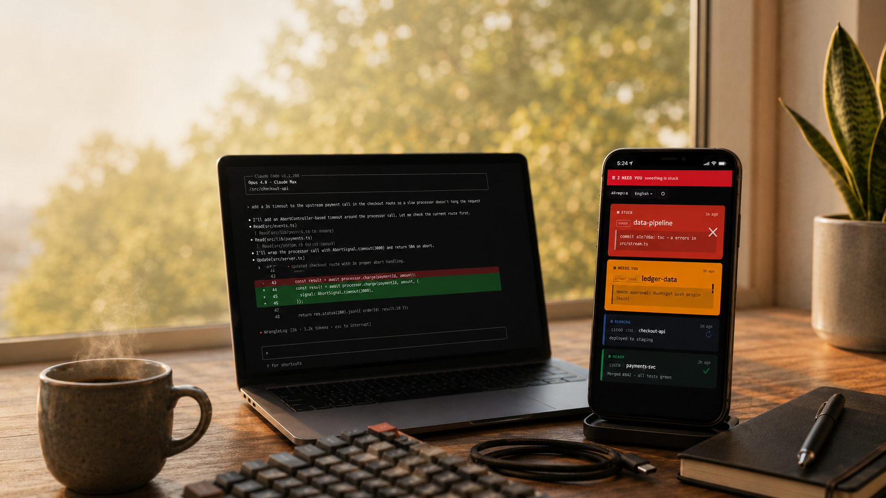
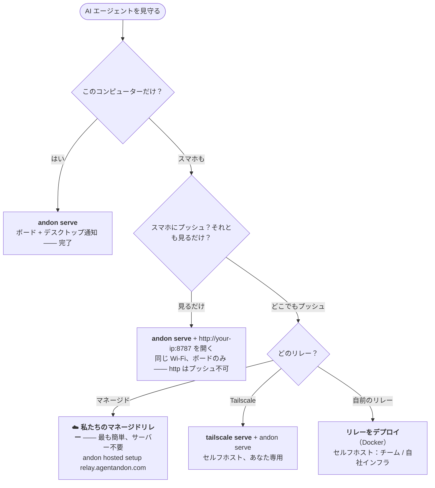

# 🚦 Agent Andon — Claude Code と Codex のためのステータスボード＆通知ツール

**iPad でもスマホでもブラウザでも、画面をちらっと見るだけ——あるいはデスクトップ通知で——AI コーディングエージェントが実行中なのか、あなた待ちなのか、完了したのか、スタックしたのかが、その瞬間にわかる。**

[English](README.md) · [中文](README.zh-CN.md) · **日本語** · [한국어](README.ko.md) · [Español](README.es.md) · [Deutsch](README.de.md) · [Français](README.fr.md)

[](LICENSE)
[](https://nodejs.org)


**⚡ 最速で始める** — たった 3 コマンドで、どこからでもスマホでエージェントを見守れます。リレーが扱うのは復号できない暗号文だけ——あなたのコードは外に出ません：

```bash
npm i -g agent-andon
andon hosted setup https://relay.agentandon.com
andon install claude
```
*（その後エージェントを再起動 · お試しだけ？`npx agent-andon serve --demo`）*

使っていない iPad を机の上に立てておきましょう——あるいはスマホや任意のブラウザでボードを開くだけでもOK。
**Claude Code** や **OpenAI Codex** にタスクを投げたら、あとは安心して別のことを——エージェントが
**実行中・あなた待ち・完了・スタック** のどれなのか、ちらっと見るだけでわかります。ターミナルに張り付く必要も、戻り忘れもありません。

これは軽量・セルフホストで、**複数の AI コーディングエージェントを同時に見守り**、**いずれかが承認を求めたり、
自分のターンを終えたり、ブロックされたりした瞬間に通知を受け取る** ための仕組みです——通知はボード（どのデバイスでも）、
デスクトップのバナー、メニューバーから。アプリ不要・アカウント不要・依存ゼロ。



*すべての AI コーディングエージェントを 1 枚のボードで——あなたを必要とするものが一番上に浮かび上がります。左は Claude Code と Codex のセッション、右のスマホにはそのライブ状態。*


> *行灯（あんどん／Andon）* はリーン生産方式の信号ボードです。あるラインが正常に動いているのか、
> それとも人の手が必要なのかを、現場の誰もが一目で把握できる「あかり」のこと。同じ発想を、
> あなたのエージェントに。

- **ランタイム依存ゼロ** —— Node.js 標準ライブラリだけ。
- **コマンド1つで接続** —— `andon install claude` がフック設定を書き換えてくれます（バックアップ付き）。
- **マルチエージェントにネイティブ対応** —— 1セッションにつき横幅いっぱいの1行。あなた待ちのものが最上部に浮かび上がります。
- **あなたの言語で** —— **English · 中文 · 日本語 · 한국어 · Español · Deutsch · Français** を自動判定。
- **どの画面でも** —— iPad、スマホ、ブラウザ。アプリ不要・アカウント不要・専用ハード不要。

---

## Claude Code や Codex が確認を求めたり、完了したり、行き詰まったら通知を受け取る

Agent Andon は **Claude Code** と **OpenAI Codex** のネイティブなライフサイクルフックを導入し、各ターンを一目でわかるシグナルに変えます（ボード・デスクトップ通知・スマホ通知）。ターミナルを見張って入力待ちをする必要はもうありません。

## 複数の Claude Code / Codex エージェントをまとめて見守る

複数セッションを並行で動かし、エージェントごとに 1 行で表示。**あなたの操作が必要な**ものが自動で一番上に浮かびます。たくさん動かしても、本当に必要なときだけ見れば済みます。

## 既定でセルフホスト・プライベート

純粋な Node 標準ライブラリ、ランタイム依存ゼロ、アカウント不要、テレメトリなし——あなたのマシンで動きます。任意のコンテンツブラインド中継（復号できない暗号文だけを保存）を使えば、コードを晒さずにどこからでもボードとスマホ通知を利用できます。

## ドキュメント

はじめてですか？ **[インストール](#インストール)** → **[クイックスタート（60秒）](#クイックスタート60秒)** → **[どのセットアップが必要？](#どのセットアップが必要)**。
さらに深く知りたい方は以下を（ドキュメントは現在すべて英語です）：

| ガイド | 内容 |
|---|---|
| **[コマンドとイベントマッピング](docs/commands.md)** | 完全な CLI · Claude/Codex のイベント→状態 · バックグラウンドタスクのカウント · タイルへの命名 |
| **[通知](docs/notifications.md)** | デスクトップ通知 · メニューバー · 承認の調整 |
| **[実行する](docs/running.md)** | ボード、**Tailscale Serve**、リレーの起動 / 確認 / 停止 |
| **[設定とセキュリティ](docs/configuration.md)** | 環境変数 · トークン認証 · ネットワークモデル |
| **[ホスティングされたボード](docs/hosted.md)** · **[リレーのデプロイ](docs/deploy-relay.md)** | 「どこからでも使えるボード」のリレー —— 使うのも、自分で動かすのも自由 |
| **[トラブルシューティングと FAQ](docs/troubleshooting.md)** · **[開発](docs/develop.md)** | 調子が悪いとき · コントリビュート |

---

## 仕組み

```
Claude Code / Codex  ──(ネイティブ hook)──▶  andon サーバー（あなたのPC）  ◀──(SSE プッシュ)──  iPad / スマホ / ブラウザ
```

1. **検知** —— 各ツールに備わったネイティブのフック機構が状態の変化を報告します。あなたのワークフローは変わりません。
2. **中継** —— あなたのコンピューター上の極小の HTTP サーバーがそれらのイベントを受け取ります。
3. **表示** —— ボードは SSE ストリームを開いたまま保持するので、状態の変化は1秒かからずに表示されます
   （失敗時は1秒間隔のポーリングにフォールバック）。上部を横切る信号バーが「シグナルタワー」で、部屋の反対側からでも読み取れます。

状態の優先順位（上部のバーと行の並び順は、最も緊急なものを採用します）：
`スタック（赤） > あなた待ち（アンバー） > 完了（緑） > 実行中（青） > アイドル`。

**ボード本体：** 1プロセスにつき横幅いっぱいの1行。**スタック / あなた待ち** は大きくなり、**メッセージ全文** を表示して
最上部に浮かび上がります（自動スクロールで画面内に表示）。一方で *実行中 / 準備完了 / アイドル* はコンパクトなまま。
デフォルトは静かで、最も緊急な1行だけが脈打ちます。1画面につき1言語を自動判定（ヘッダーのドロップダウンや
`?lang=` で上書き可能）。

---

## インストール

```bash
npm install -g agent-andon      # または：npx agent-andon serve --demo
```

ソースから：

```bash
git clone https://github.com/tianshanghong/agent-andon && cd agent-andon
npm install && npm run build
node dist/cli.js serve --demo
```

> Node.js ≥ 18 が必要です。

---

## クイックスタート（60秒）

**1. ダミーデータでボードを確認する：**

```bash
andon serve --demo
```

`http://<your-ip>:8787` という URL が表示されます。スマホ、タブレット、ブラウザのどれで開いても——2行のカードが
色を変えながら循環しているはずです。問題なさそうなら `Ctrl-C` で止めて、本番用に実行します：

```bash
andon serve
```

**2. ボードを開く**（iPad、スマホ、または任意のブラウザ。コンピューターと同じ Wi-Fi で）：

- 表示された URL を開きます。**`http://` です。`https://` ではありません。**
- **「Enable sound」** を一度タップして通知音を有効にします（ブラウザはタップするまで音をミュートします。これはボードの
  ブラウザ内蔵サウンドで、デフォルトでオンのデスクトップ通知とは別物です）。リロードしても記憶されます。
- スマホ／タブレットでは：**ホーム画面に追加** すると、アドレスバーのないフルスクリーンのボードになります。（壁掛けの iPad では
  さらに **自動ロック → なし** に設定しましょう。ページ側も Wake Lock を要求します。）

**3. エージェントを接続する：**

```bash
andon install claude        # ~/.claude/settings.json を書き換え（.andon-backup を保持）
andon install codex         # ~/.codex/hooks.json を書き換え（.andon-backup を保持）
andon doctor                # すべて接続済みか確認。ボードの URL を再表示
```

Claude Code のセッションを再起動すれば、自動的にボードが点灯します。これだけです。

> この Wi-Fi だけでなく、**どこからでも** ボード（とスマホへのプッシュ）を使いたい？ → [**どのセットアップが必要？**](#どのセットアップが必要)

---

## どのセットアップが必要？

### 🔧 自分で動かしたい？

`andon serve` でボード一式をローカルで実行（無料・デスクトップ通知あり・リレー不要）。または `andon relay` で自分のリレーを運用（`andon verify <url>` で任意のリレーを検証）。→ [セルフホストガイド全文](docs/deploy-relay.md)

`andon serve` だけで、ボード + **それを実行しているコンピューター上のデスクトップ通知** が手に入ります——無料・ゼロ設定で、
**macOS / Linux / Windows** に対応。もう少し手間がかかるのは **スマホへのプッシュ通知** です。*スマホはロック中、あなたは机から
離れている*——そんなときにエージェントがあなたを必要としたら、ブルッと震えて知らせます。スマホへのプッシュには、**HTTPS** で
アクセスできるリレーと、スマホでの **「ホーム画面に追加」**（iPhone／iPad では必須）が必要です。**いちばん簡単なのは私たちの
マネージドリレーです——自分で何かを動かす必要も、Tailscale も、HTTPS の設定も不要。**



| あなたが望むこと… | こうする |
|---|---|
| コンピューター上でボード + **デスクトップ通知** | `andon serve` —— デフォルト *(macOS / Linux / Windows)*、通知オン |
| **同じ Wi-Fi のスマホ／タブレット** でボードをちらっと見る | `andon serve`、`http://<your-ip>:8787` を開く —— *ボードのみ。`http` はプッシュ不可* |
| **📱 スマホへのプッシュ —— 簡単な方法** *(サーバー不要、Tailscale 不要)* | **☁️ 私たちのマネージドリレー：** `andon hosted setup https://relay.agentandon.com` + ホーム画面に追加 —— *公開準備中、[⭐ ウォッチ](https://github.com/tianshanghong/agent-andon)* |
| スマホへのプッシュ、**セルフホスト —— あなた専用** | [`tailscale serve`](docs/running.md) + `andon serve` + ホーム画面に追加 |
| スマホへのプッシュ、**自前のリレー**（チーム / 自社インフラ） | [リレーをデプロイ](docs/deploy-relay.md)（Docker）+ ホーム画面に追加 |

**目安：** `andon serve` はどこでも無料で **デスクトップ** 通知を提供します。**スマホ** でも受け取りたい？
—— いちばん簡単なのは私たちの **マネージドリレー**（何も動かす必要なし）。あるいは **Tailscale** でセルフホスト（あなた専用）するか、
**自前のリレー**（チーム向け）を立てましょう。

---

## コマンド

```bash
andon serve                 # ボードを起動（デスクトップ通知はデフォルトでオン）
andon install claude        # Claude Code のフックを接続（codex なら：install codex）
andon doctor                # ヘルスチェック + ボードの URL
andon post <state> <agent>  # 手動でステータスを送信
andon uninstall claude      # Andon が追加したものをきれいに削除
```

完全なリファレンス——すべてのフラグ、Claude/Codex の **イベント → 状態** マッピング、バックグラウンドタスクのカウント、
タイルへの命名——は **[docs/commands.md](docs/commands.md)**（英語）にあります。

---

## 通知

デスクトップ通知は **デフォルトでオン** です——サーバーを実行しているコンピューターにバナー（あなた待ち / スタックのときは音も）を
表示し、macOS / Linux / Windows で優雅にデグレードします。メニューバーのサマリーもあります。`--say` / `--no-notify` で調整したり、
安全な操作を事前承認してアンバーの発火を減らしたりできます。詳しくは **[docs/notifications.md](docs/notifications.md)**（英語）を参照。

---

## 実行する（起動 / 停止）

```bash
andon serve                                  # フォアグラウンド —— Ctrl-C で停止
nohup andon serve > /tmp/andon.log 2>&1 &    # バックグラウンド（macOS / Linux）
pkill -f "cli.js serve"                      # バックグラウンドのインスタンスを停止
```

ボード、**Tailscale Serve**、リレーの起動 / 確認 / 停止の完全な手順：**[docs/running.md](docs/running.md)**（英語）。

---

## ホスティング（「どこからでも使えるボード」）

Andon はローカルファーストで、**永遠に無料でセルフホストできます**——これが今後もデフォルトです。オプションの、**あなたが自分で
有効にする** リレーを使えば、どこからでもボード + スマホへのプッシュが手に入ります——**私たちのマネージドリレー**（設定ゼロ）を
使うか、**自分で動かす**（同じオープンソースのコード）かのどちらかです：

```bash
andon hosted setup https://relay.agentandon.com   # 有効化 —— あなたのマシンから一切出ない鍵が生成される
andon relay                                        # …または、このコンテンツを読めないリレーを自分で動かす
andon verify <relay-url>                           # リレーが提供しているのがまさにこのオープンソースのコードか確認
```

各ステータスの**内容(タイトル・メッセージ・agent 名)は、あなたのマシンを出る前に手元でエンドツーエンド暗号化**されます。
リレーは**復号できないその暗号文だけ**をルーティング・保存し(鍵は一切アップロードされません)、あなたのプロンプト、コード、
タイトル、メッセージを読むことはできません。見えるのは粗いメタデータ——アクティブかどうか、おおよその時刻、概要ステータス、そしてあなたの IP だけです。*「ただ信頼するのではなく、検証できる」：* 提供されるコードはオープンソース
かつ再現可能で、`andon verify` がリレーの提供するコードがまさにそれであることを確認します。詳しいガイド：
**[ホスティングされたボードを使う](docs/hosted.md)** · **[リレーをデプロイする](docs/deploy-relay.md)**（英語）。

> **何も動かしたくない？** `relay.agentandon.com` にある私たちのマネージドリレーが、設定ゼロの道です——
> **まもなく公開** です。**⭐ star / watch** して、公開の瞬間を見逃さないように。

---

## セキュリティ

デフォルトでは、サーバーは `0.0.0.0` に **認証なし** でバインドします——信頼できる家庭の Wi-Fi なら問題ありませんが、
公開／信頼できないネットワークでは **NG** です。共有ネットワークでは `ANDON_TOKEN` を設定し、ポートフォワードはしないでください
（上記の HTTPS の方法を使いましょう）。ボードが公開するのは高レベルのステータスだけで、コードやログは一切含みません。
詳細 + 環境変数：**[docs/configuration.md](docs/configuration.md)**（英語）。

---

## ライセンス

[AGPL-3.0-or-later](LICENSE) —— © 2026 wwang。

Andon は自由に実行・セルフホスト・監査・fork・改変できます。**改変した** バージョンをネットワークサービスとして運用する場合、
AGPL 第13条はそのソースをユーザーに提供することを求めます。改変せずに運用する場合（自分のエージェントとやり取りする壁掛けボードなど）には、
そのような義務はありません。メンテナーは、ホスティングサービス向けに別途の商用ライセンスでも Andon を提供しています——それがどうやって
可能であり続けるのかは [CONTRIBUTING](CONTRIBUTING.md) を参照してください。

**「Andon」／「Agent Andon」** という名称とロゴは、作者が保有する標章です——ライセンスが対象とするのはコードであって、名称では
ありません（[TRADEMARK](TRADEMARK.md) を参照）。fork は別の名前を使う必要があります。
