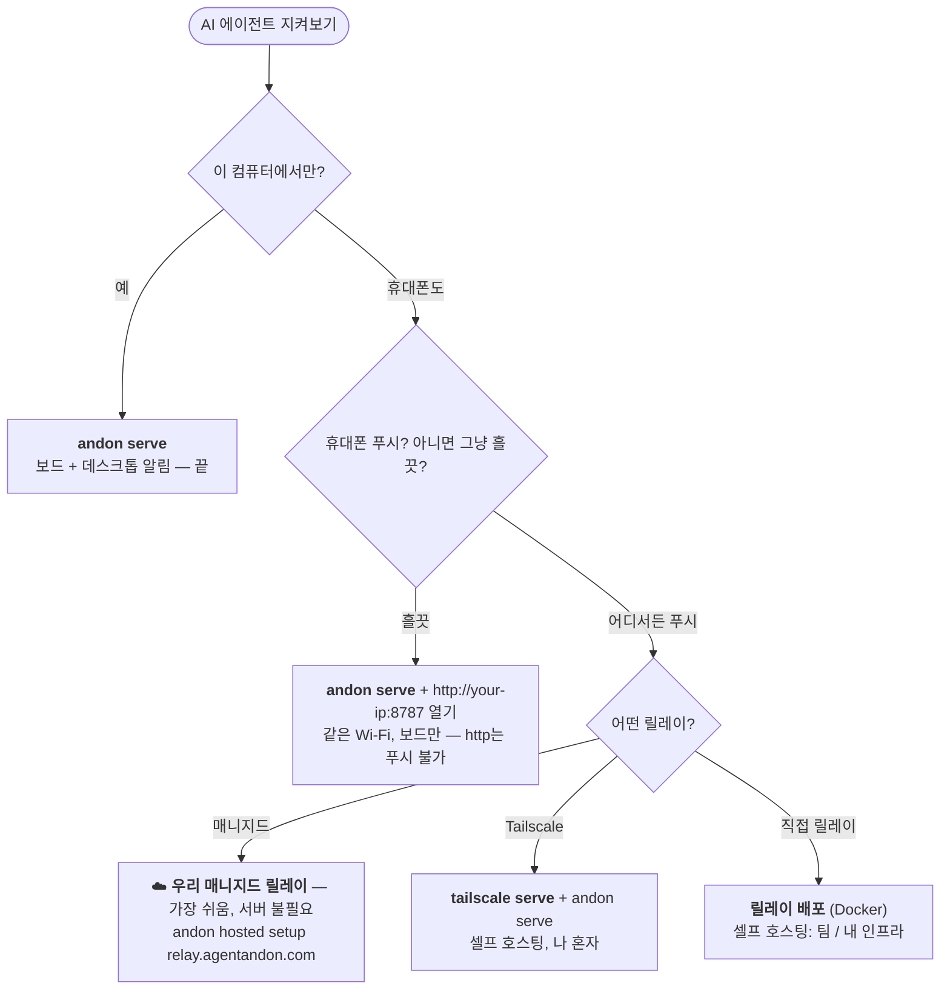

# 🚦 Agent Andon — Claude Code와 Codex를 위한 상태 보드 & 알리미

**아무 화면(iPad, 휴대폰, 브라우저)이나 흘끗 보거나 데스크톱 알림을 받으세요 — AI 코딩 에이전트가 작업 중인지, 확인이 필요한지, 완료됐는지, 막혔는지 그 즉시 파악할 수 있습니다.**

[English](README.md) · [中文](README.zh-CN.md) · [日本語](README.ja.md) · **한국어** · [Español](README.es.md) · [Deutsch](README.de.md) · [Français](README.fr.md)

[](LICENSE)
[](https://nodejs.org)


**⚡ 가장 빠른 시작** — 설치하고 우리 매니지드 릴레이에 연결한 뒤, 휴대폰에서 지켜보세요:

```bash
npm i -g agent-andon
andon hosted setup https://relay.agentandon.com
andon install claude
```
*(그다음 에이전트 재시작 · 그냥 둘러보기? `npx agent-andon serve --demo`)*

안 쓰는 iPad를 책상에 세워 두세요 — 아니면 휴대폰이나 아무 브라우저로 보드를 열어도 됩니다.
**Claude Code**나 **OpenAI Codex**에 작업을 맡긴 다음, 마음 놓고 다른 일을 하세요 — 에이전트가
**작업 중인지, 확인이 필요한지, 완료됐는지, 막혔는지** 한눈에 알 수 있습니다. 터미널을 붙잡고 지켜볼
필요도, 돌아오는 걸 깜빡할 일도 없습니다.

여러 AI 코딩 에이전트를 **한꺼번에 지켜보고**, 그중 하나가 **승인을 기다리거나, 자기 차례를 끝냈거나,
막혔을 때 그 즉시 알림을 받는** 가볍고 셀프 호스팅 가능한 방법입니다 — 알림은 보드(어떤 기기든),
데스크톱 배너, 또는 메뉴 바로 옵니다. 앱도, 계정도 필요 없고 의존성은 제로입니다.


> *안돈*(行灯, Andon)은 린 제조 현장의 신호 보드입니다. 불빛 하나로 라인이 정상 가동 중인지,
> 사람 손이 필요한지를 작업장 전체가 한눈에 알 수 있게 해주죠. 당신의 에이전트에도 똑같은 발상을
> 적용한 겁니다.

- **런타임 의존성 제로** — 순수 Node.js 표준 라이브러리만 사용합니다.
- **명령어 하나로 연결** — `andon install claude`가 hook 설정을 알아서 고쳐줍니다(백업도 남깁니다).
- **멀티 에이전트 기본 지원** — 세션마다 전체 너비 한 줄씩 차지하고, 당신을 필요로 하는 것이 맨 위로 떠오릅니다.
- **당신의 언어로** — **English · 中文 · 日本語 · 한국어 · Español · Deutsch · Français**를 자동으로 감지합니다.
- **어떤 화면에서나** — iPad, 휴대폰, 브라우저 모두 가능. 앱도, 계정도, 별도 하드웨어도 필요 없습니다.

---

## 문서

처음이신가요? **[설치](#설치)** → **[빠른 시작 (60초)](#빠른-시작-60초)** → **[어떤 방식이 필요한가요?](#어떤-방식이-필요한가요)**. 더 깊이 알고 싶다면(아래 문서는 영어입니다):

| 가이드 | 내용 |
|---|---|
| **[명령어 & 이벤트 매핑](docs/commands.md)** | 전체 CLI · Claude/Codex 이벤트→상태 · 백그라운드 작업 카운트 · 카드 이름 지정 |
| **[알림](docs/notifications.md)** | 데스크톱 알림 · 메뉴 바 · 승인 정책 조정 |
| **[실행하기](docs/running.md)** | 보드 시작 / 확인 / 중지, **Tailscale Serve**, 릴레이 |
| **[설정 & 보안](docs/configuration.md)** | 환경 변수 · 토큰 인증 · 네트워크 모델 |
| **[호스팅 보드](docs/hosted.md)** · **[릴레이 배포](docs/deploy-relay.md)** | "어디서든 보는 보드" 릴레이 — 직접 쓰거나, 하나 띄우세요 |
| **[문제 해결 & FAQ](docs/troubleshooting.md)** · **[개발](docs/develop.md)** | 뭔가 잘 안 될 때 · 기여하기 |

---

## 동작 방식

```
Claude Code / Codex  ──(네이티브 hook)──▶  andon 서버(당신의 컴퓨터)  ◀──(SSE 푸시)──  iPad / 휴대폰 / 브라우저
```

1. **감지** — 각 도구의 네이티브 hook 메커니즘이 상태 변화를 보고합니다. 당신의 작업 흐름은 그대로입니다.
2. **중계** — 당신 컴퓨터에서 도는 아주 작은 HTTP 서버가 이 이벤트들을 받습니다.
3. **표시** — 보드는 SSE 스트림을 계속 열어 두기 때문에 상태 변화가 1초도 안 돼서 나타납니다
   (여의치 않으면 1초 폴링으로 폴백합니다). 상단을 가로지르는 신호 바가 바로 "신호탑 등(tower light)"으로,
   방 건너편에서도 보입니다.

상태 우선순위(상단 바와 행 정렬 순서는 가장 긴급한 것을 따릅니다):
`막힘(빨강) > 확인 필요(주황) > 완료(초록) > 작업 중(파랑) > 유휴`.

**보드 자체:** 프로세스마다 전체 너비 한 줄을 차지합니다. **막힘 / 확인 필요**는 크게 커지고
**전체 메시지**를 보여주며 맨 위로 떠오릅니다(자동으로 화면에 스크롤됩니다). 반면 *작업 중 / 준비됨 / 유휴*는
작게 유지됩니다. 기본적으로 조용합니다 — 가장 긴급한 단 한 줄만 깜빡입니다. 화면마다 한 가지 언어를
자동 감지합니다(상단 드롭다운이나 `?lang=`로 바꿀 수 있습니다).

---

## 설치

```bash
npm install -g agent-andon      # 또는: npx agent-andon serve --demo
```

소스에서 설치하려면:

```bash
git clone https://github.com/tianshanghong/agent-andon && cd agent-andon
npm install && npm run build
node dist/cli.js serve --demo
```

> Node.js ≥ 18이 필요합니다.

---

## 빠른 시작 (60초)

**1. 가짜 데이터로 보드를 확인하세요:**

```bash
andon serve --demo
```

`http://<your-ip>:8787` 형태의 URL이 출력됩니다. 휴대폰, 태블릿, 브라우저 어디서든 열어 보세요 — 두 줄짜리
카드가 색을 바꿔가며 도는 게 보일 겁니다. 제대로 보이면 `Ctrl-C`로 끄고 실제로 실행하세요:

```bash
andon serve
```

**2. 보드를 여세요** (iPad, 휴대폰, 또는 아무 브라우저, 컴퓨터와 같은 Wi-Fi):

- 출력된 URL을 여세요. **`https://`가 아니라 `http://`입니다.**
- 알림음을 켜려면 **"Enable sound"**를 한 번 누르세요(브라우저는 사용자가 누르기 전까지 오디오를 음소거합니다.
  이건 보드의 브라우저 내장 사운드로, 기본적으로 켜져 있는 데스크톱 알림과는 별개입니다). 새로고침해도 기억됩니다.
- 휴대폰/태블릿에서는 **홈 화면에 추가**하면 주소창 없는 전체 화면 보드가 됩니다. (벽에 거는 iPad라면
  **자동 잠금 → 안 함**으로도 설정하세요. 페이지가 Wake Lock도 요청합니다.)

**3. 에이전트를 연결하세요:**

```bash
andon install claude        # ~/.claude/settings.json을 수정합니다(.andon-backup 보관)
andon install codex         # ~/.codex/hooks.json을 수정합니다   (.andon-backup 보관)
andon doctor                # 모두 연결됐는지 확인하고, 보드 URL을 다시 출력합니다
```

Claude Code 세션을 다시 시작하면 보드가 자동으로 켜집니다. 이게 전부입니다.

> 이 Wi-Fi뿐 아니라 **어디서든** 보드(그리고 휴대폰 푸시)를 쓰고 싶으신가요? → [**어떤 방식이 필요한가요?**](#어떤-방식이-필요한가요)

---

## 어떤 방식이 필요한가요?

`andon serve`만으로도 보드와 **그걸 실행하는 컴퓨터의 데스크톱 알림**을 바로 쓸 수 있습니다 — 무료에 설정도
필요 없고 **macOS / Linux / Windows** 모두 됩니다. 좀 더 손이 가는 부분은 **휴대폰으로 푸시**하는 것입니다.
*휴대폰이 잠겨 있고 책상을 떠나 있을 때* 에이전트가 당신을 필요로 하면 진동으로 알려주는 것이죠. 휴대폰
푸시에는 **HTTPS**로 접근할 수 있는 릴레이와 휴대폰에서의 **"홈 화면에 추가"**가 필요합니다(iPhone/iPad에서는
필수). **가장 쉬운 방법은 우리 매니지드 릴레이입니다 — 따로 띄울 것도, Tailscale도, 직접 설정할 HTTPS도
없습니다.**



| 원하는 것 | 이렇게 하세요 |
|---|---|
| 내 컴퓨터에서 보드 + **데스크톱 알림** | `andon serve` — 기본값 *(macOS / Linux / Windows)*, 알림 켜짐 |
| **같은 Wi-Fi의 휴대폰/태블릿**에서 보드 흘끗 보기 | `andon serve` 실행 후 `http://<your-ip>:8787` 열기 — *보드만; `http`는 푸시 불가* |
| **📱 휴대폰 푸시 — 가장 쉬운 길** *(서버 불필요, Tailscale 불필요)* | **☁️ 우리 매니지드 릴레이:** `andon hosted setup https://relay.agentandon.com` + 홈 화면에 추가 — *출시 예정, [⭐ watch](https://github.com/tianshanghong/agent-andon)* |
| 휴대폰 푸시, **셀프 호스팅 — 나 혼자** | [`tailscale serve`](docs/running.md) + `andon serve` + 홈 화면에 추가 |
| 휴대폰 푸시, **내 전용 릴레이** (팀 / 내 인프라) | [릴레이 배포](docs/deploy-relay.md) (Docker) + 홈 화면에 추가 |

**경험칙:** `andon serve`는 어디서나 무료로 **데스크톱** 알림을 줍니다. **휴대폰**에서도 받고 싶으신가요?
— 가장 쉬운 건 우리 **매니지드 릴레이**(아무것도 안 띄워도 됨)이고, 아니면 **Tailscale**(나 혼자)이나
**내 전용 릴레이**(팀)로 셀프 호스팅하면 됩니다.

---

## 명령어

```bash
andon serve                 # 보드 실행(데스크톱 알림 기본 켜짐)
andon install claude        # Claude Code hook 연결(install codex도 있음)
andon doctor                # 헬스 체크 + 보드 URL
andon post <state> <agent>  # 상태를 수동으로 푸시
andon uninstall claude      # Andon이 추가한 것을 깔끔하게 제거
```

전체 레퍼런스 — 모든 플래그, Claude/Codex의 **이벤트 → 상태** 매핑, 백그라운드 작업 카운트, 카드 이름 지정 —
는 **[docs/commands.md](docs/commands.md)**(영어)에 있습니다.

---

## 알림

데스크톱 알림은 **기본적으로 켜져 있습니다** — 서버를 실행하는 컴퓨터에 배너가 뜨고(확인 필요 / 막힘일 때는
소리도 납니다), macOS / Linux / Windows에서 상황에 맞게 우아하게 동작합니다. 메뉴 바 요약도 있습니다.
`--say` / `--no-notify`로 조정하거나, 안전한 작업을 미리 승인해 두면 주황색이 덜 뜨게 할 수 있습니다. 자세한
내용은 **[docs/notifications.md](docs/notifications.md)**(영어)를 참고하세요.

---

## 실행하기 (시작 / 중지)

```bash
andon serve                                  # 포그라운드 — Ctrl-C로 중지
nohup andon serve > /tmp/andon.log 2>&1 &    # 백그라운드(macOS / Linux)
pkill -f "cli.js serve"                      # 백그라운드 인스턴스 중지
```

보드, **Tailscale Serve**, 릴레이의 전체 시작 / 확인 / 중지 방법: **[docs/running.md](docs/running.md)**(영어).

---

## 호스팅 ("어디서든 보는 보드")

Andon은 로컬 우선이며 **영원히 무료로 셀프 호스팅**할 수 있습니다 — 이게 계속 기본값입니다. 선택 사항이자
**직접 켜야 하는** 릴레이를 쓰면 어디서든 보드 + 휴대폰 푸시를 받을 수 있습니다 — **우리 매니지드
릴레이**(설정 제로)를 쓰거나 **직접 하나 띄우면**(같은 오픈소스 코드) 됩니다:

```bash
andon hosted setup https://relay.agentandon.com   # 켜기 — 절대 기기를 벗어나지 않는 키가 생성됩니다
andon relay                                        # …또는 콘텐츠를 못 읽는 릴레이를 직접 실행
andon verify <relay-url>                           # 릴레이가 바로 그 오픈소스 코드를 제공하는지 확인
```

각 상태의 **내용(제목·메시지·agent 이름)은 기기를 벗어나기 전에 당신의 기기에서 종단 간 암호화**됩니다. 릴레이는
**복호화할 수 없는 그 암호문만** 라우팅·저장하며(키는 전송되지 않습니다), 당신의 프롬프트나 코드, 제목, 메시지는 읽지
못합니다. 볼 수 있는 건 거친 메타데이터 — 활동 중인지, 대략적인 시각, 대략적인 상태, 그리고 IP뿐입니다. *"단순히 신뢰하는 게 아니라, 검증할 수 있다":* 제공되는 코드는 오픈소스이며 재현
가능하고, `andon verify`로 어떤 릴레이가 바로 그 코드를 제공하는지 확인할 수 있습니다. 전체 가이드:
**[호스팅 보드 사용하기](docs/hosted.md)** · **[릴레이 배포](docs/deploy-relay.md)**(영어).

> **아무것도 띄우고 싶지 않다면?** `relay.agentandon.com`의 우리 매니지드 릴레이가 바로 그 무설정 경로입니다 —
> **곧 출시**됩니다. 출시 소식을 놓치지 않으려면 **⭐ star / watch** 해두세요.

---

## 보안

서버는 기본적으로 `0.0.0.0`에 바인딩되며 **인증이 없습니다** — 신뢰할 수 있는 집 Wi-Fi에서는 괜찮지만
공용/신뢰할 수 없는 네트워크에서는 **안 됩니다**. 공유 네트워크에서는 `ANDON_TOKEN`을 설정하고, 포트
포워딩은 하지 마세요(위의 HTTPS 방식을 쓰세요). 보드는 상위 수준의 상태만 노출합니다 — 코드나 로그는 절대
노출하지 않습니다. 자세한 내용 + 환경 변수: **[docs/configuration.md](docs/configuration.md)**(영어).

---

## 라이선스

[AGPL-3.0-or-later](LICENSE) — © 2026 wwang.

Andon은 자유롭게 실행, 셀프 호스팅, 감사(audit), 포크, 수정할 수 있습니다. **수정한** 버전을 네트워크
서비스로 운영한다면 AGPL 제13조에 따라 그 소스를 사용자에게 제공해야 합니다. 수정하지 않고 그대로 운영하는
경우(자기 에이전트와만 통신하는 벽걸이 보드)에는 그런 의무가 없습니다. 메인테이너는 호스팅 서비스를 위해
별도의 상업용 조건으로도 Andon을 제공합니다 — 그것이 어떻게 가능한지는 [CONTRIBUTING](CONTRIBUTING.md)을
참고하세요.

**"Andon" / "Agent Andon"**이라는 이름과 로고는 저작자가 보유한 표장(標章)입니다 — 라이선스가 적용되는 것은
코드이지 이름이 아닙니다([TRADEMARK](TRADEMARK.md) 참고). 포크는 반드시 다른 이름을 써야 합니다.
