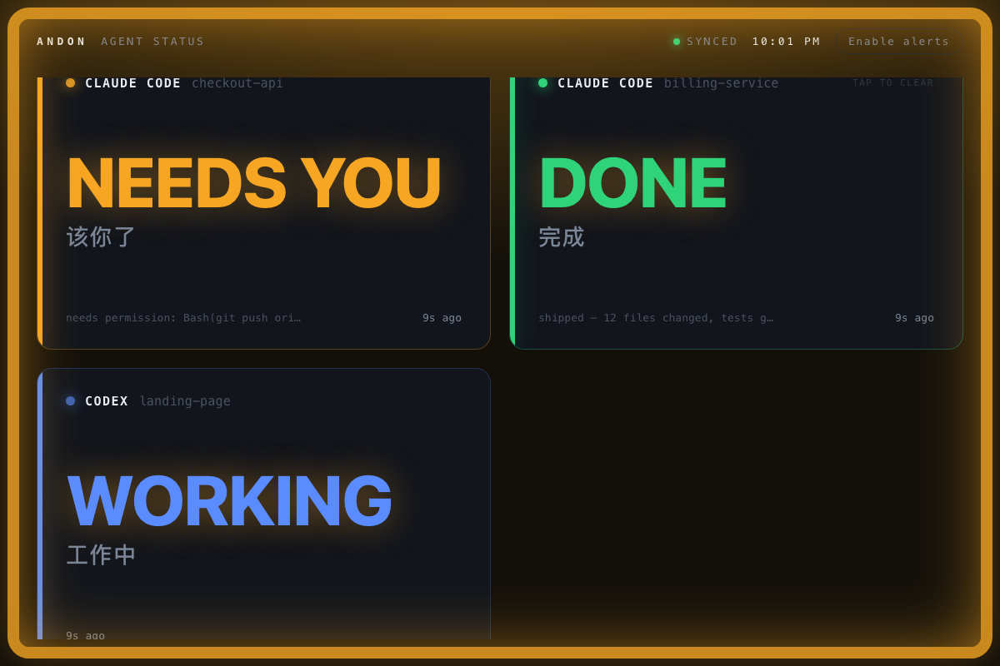

# 🚦 Agent Andon

**A traffic-light status board for your AI coding agents.**

Stand an old iPad on your desk. Submit a task to Claude Code or Codex, then go do
something else. One glance at the iPad tells you whether your agent is **working,
needs you, done, or stuck** — no babysitting the terminal, no forgetting to come back.



> *Andon* (行灯) is the lean-manufacturing signal board: a light that tells the
> whole floor, at a glance, whether a line is running or needs a human. Same idea,
> for your agents.

- **Zero runtime dependencies** — pure Node.js standard library.
- **One command to wire up** — `andon install claude` edits your hooks for you (with a backup).
- **Multi-agent native** — every session is its own tile; the screen edge glows the most-urgent state.
- **Just an iPad + Safari** — no app, no hardware, no account.

<sub>中文用户：把闲置 iPad 立在桌边，变成 Claude Code / Codex 的"安灯"状态看板。提交任务后放心去干别的，一瞥就知道 agent 在跑 / 该你了 / 完成了 / 卡住了。</sub>

---

## How it works

```
Claude Code / Codex  ──(native hook)──▶  andon server (your Mac)  ◀──(polls 1×/s)──  iPad Safari
```

1. **Detect** — each tool's native hook mechanism reports state changes. No change to your workflow.
2. **Relay** — a tiny HTTP server on your Mac receives the events.
3. **Display** — the iPad opens the board and polls once a second. The whole border becomes
   the "tower light," readable from across the room; *needs-you* / *stuck* pulse and chime.

State priority (the border takes the most urgent one):
`stuck (red) > needs-you (amber) > done (green) > working (blue) > idle`.

---

## Install

```bash
npm install -g agent-andon      # or: npx agent-andon serve --demo
```

From source:

```bash
git clone <your-repo> agent-andon && cd agent-andon
npm install && npm run build
node dist/cli.js serve --demo
```

> Requires Node.js ≥ 18.

---

## Quickstart (60 seconds)

**1. Verify the board with fake data:**

```bash
andon serve --demo
```

It prints a `http://<your-mac-ip>:8787` URL. Open it on the iPad — you should see two
tiles cycling colors. Once it looks right, `Ctrl-C` and run for real:

```bash
andon serve
```

**2. Set up the iPad** (same Wi-Fi as the Mac):

- Safari → open the printed URL. **It's `http://`, not `https://`.**
- Tap **"Enable alerts"** to unlock the chime (Safari needs one tap for audio).
- Share → **Add to Home Screen** → launch from the icon for a full-screen, address-bar-free board.
- Belt-and-suspenders against sleep: **Settings → Display & Brightness → Auto-Lock → Never.**
  (The page also requests a Wake Lock.)

**3. Wire up your agents:**

```bash
andon install claude        # edits ~/.claude/settings.json (keeps a .andon-backup)
andon install codex         # edits ~/.codex/config.toml   (keeps a .andon-backup)
andon doctor                # confirm everything's connected; reprints the iPad URL
```

Restart your Claude Code session and it lights up the board automatically. That's it.

---

## Commands

| Command | What it does |
|---|---|
| `andon serve [--demo] [--port N] [--token T] [--no-notify] [--say]` | Run the board server; desktop alerts on by default (`--no-notify` off, `--say` adds speech) |
| `andon install claude` | Wire Claude Code status hooks (timestamped backup) |
| `andon install codex` | Wire Codex lifecycle hooks (run `/hooks` to trust) |
| `andon uninstall <claude\|codex>` | Remove only what Andon added; leaves the rest of your config intact |
| `andon doctor` | Health check + what's wired + iPad URL |
| `andon post <state> <agent> [title] [msg]` | Push a status by hand |
| `andon sub <+n\|-n> [id]` | Bump a process's background-task count |
| `andon hook` / `andon codexhook` | *(internal — invoked by the hooks)* |

`andon install --dry-run claude` prints the change without writing.

### Event → state mapping (Claude Code)

| Claude Code event | Board state | When |
|---|---|---|
| `SessionStart` | idle (slate) | session launched — the tile appears right away |
| `UserPromptSubmit` | working (blue) | you just submitted a prompt |
| `PostToolUse` | working (blue) | a tool just ran — clears amber the moment you approve |
| `Notification` | needs-you (amber, pulses) | waiting on permission / your input |
| `Stop` | **ready** (green) | turn handed back to you — your move, *not* "all done" |
| `StopFailure` | stuck (red, pulses) | the turn failed (newer Claude Code only) |
| `SessionEnd` | *removed* | session ended; tile disappears |

Multiple sessions each get their own tile (keyed by `session_id`). One process =
one tile; its sub-agents roll up into it rather than spawning their own. A session
that was *already running* before the board started appears on its next event
(prompt, tool, turn end) — Andon stays out of your statusLine entirely.

### Background work: keep a card honest past "done"

`Stop` means the foreground agent handed the turn back — it does **not** mean
background work finished. If a process kicks off background workflows, have them
report so the card stays "running" (blue) until they drain instead of falsely
going green:

```bash
export ANDON_SESSION="<this process's tile id>"   # the session_id of the parent tile
andon sub +1     # a background task started
#   ...do the work...
andon sub -1     # it finished
```

While the count is `> 0` the card reads `WORKING ⋯N background` and only turns
green once every task has reported `-1`.

### Codex

Modern Codex (≈ 0.117+) has a full Claude-compatible **hooks** system, so Andon
gets the same lifecycle as Claude Code — including amber **needs-you**:

```bash
andon install codex      # wires lifecycle hooks → ~/.codex/hooks.json
```

| Codex hook event | Board state |
|---|---|
| `SessionStart` | idle (tile appears at launch) |
| `UserPromptSubmit` / `PostToolUse` | working (blue) |
| `PermissionRequest` | **needs-you (amber)** |
| `Stop` | ready (green) |
| `SessionEnd` | *removed* |

> **One extra step Codex requires:** new hooks must be **trusted** before they
> run — run `/hooks` inside Codex once (or launch `codex
> --dangerously-bypass-hook-trust`). `andon uninstall codex` cleanly removes the
> hooks again, with a timestamped backup.

Residual caveat: red "stuck" stays staleness-based (no dedicated failed-turn
hook). (Already-running sessions appear on their next event, same as Claude.)

---

## Get pulled back: desktop alerts & menu bar

Andon's whole job is to **grab your attention at the right moment** — when an
agent needs you or gets blocked — and otherwise stay quiet. The board is the
universal channel (works on any device); these add more, each degrading
gracefully across macOS / Linux / Windows.

**Native desktop alerts** — a banner on the machine running the server, **on by
default**. Loud for the states that need you, quiet for completion:

- **needs-you (amber)** / **stuck (red)** → banner + sound (immediate).
- **done (green)** → one *quiet* banner (no sound), debounced 4s so a transient
  green never fires a false "ready".

```bash
andon serve                 # alerts on by default
andon serve --say           # also speak needs-you / stuck aloud
andon serve --no-notify     # turn alerts off
```
Uses `osascript`/`say` (macOS), `notify-send`/`spd-say` (Linux), PowerShell
toast/`System.Speech` (Windows). Missing tool → silently skipped. (Auto-off
under `--demo` so the cycling fake agents don't spam you.) Alerts are
**throttled** (per-session cooldown + a global token bucket) so a busy — or
malicious — LAN client posting to `/event` can't drive a process-spawn flood.

**Menu / status bar** — a one-glance summary without a separate iPad:

```bash
curl -s http://127.0.0.1:8787/menubar     # plain-text summary endpoint
```
Wire it to SwiftBar/xbar (macOS) or Waybar/polybar (Linux); see
`examples/andon-menubar.5s.sh`.

### Fewer interruptions? Configure approvals yourself

Andon **never touches your permission/approval settings** — that's yours to own.
If amber "needs you" fires more than you'd like, pre-approve safe operations in
your agent's own config (Andon will then only light up for the rest):

- **Claude Code** — add read-only patterns to `permissions.allow` in
  `~/.claude/settings.json`, e.g. `"Read"`, `"Bash(git status:*)"`,
  `"Bash(npm test:*)"`. Your `deny`/`ask` rules always take precedence, and the
  Bash matcher is shell-operator-aware (so `Bash(git status:*)` won't approve
  `git status && rm -rf`). See `/permissions`.
- **Codex** — set `approval_policy` (e.g. `"untrusted"` auto-runs trusted
  read-only commands) and/or `sandbox_mode` in `~/.codex/config.toml`.

Keeping this in *your* hands means Andon can never weaken your safety rules —
and the board stays a faithful mirror of when you're genuinely needed.

## Naming a tile

The default title is the project folder name. Override per-terminal:

```bash
ANDON_LABEL="backend refactor" claude
ANDON_LABEL="landing copy"     codex
```

---

## Run it in the background

```bash
# tmux
tmux new -s andon 'andon serve'

# or nohup
nohup andon serve >/tmp/agent-andon.log 2>&1 &

# or at login: see examples/com.agentandon.server.plist
```

---

## Security

By default the server binds `0.0.0.0` with **no authentication** — anyone on the LAN can
read and post status. Fine on a trusted home Wi-Fi; **don't run it on a public/untrusted
network.** For a shared network, set a token (export it everywhere the hooks run too):

```bash
ANDON_TOKEN=somesecret andon serve
```

With a token set, `/state` and `/event` require it. The hooks and CLI send it as an
`x-andon-token` header automatically (as long as `ANDON_TOKEN` is in their environment);
on the iPad, open the board with `?token=somesecret` and it carries the token through.
`/healthz` stays open so `andon doctor` always works.

The board only ever exposes high-level status (state, project name, a one-line message) —
never code or full logs. Event bodies are capped at 64 KB.

---

## Configuration

| Env var | Default | Meaning |
|---|---|---|
| `AGENT_STATUS_URL` | `http://127.0.0.1:8787` | server base URL the hooks post to |
| `ANDON_TOKEN` | *(none)* | shared token required by `/state` and `/event` when set |
| `ANDON_PORT` / `ANDON_HOST` | `8787` / `0.0.0.0` | server bind |
| `ANDON_LABEL` | folder name | tile title (per terminal) |
| `ANDON_SESSION` | — | override a tile's session id (e.g. for a background job) |

---

## Develop

```bash
npm run build     # tsc -> dist/
npm test          # node:test unit tests for the store (Node 22.6+)
npm run dev       # tsc --watch
```

Architecture: `src/store.ts` is the pure, tested state model; `src/server.ts` is the
HTTP layer; `src/commands/*` are the CLI verbs; `assets/dashboard.html` is the
self-contained board.

---

## Troubleshooting

- **iPad can't open the page** — same Wi-Fi? `http` not `https`? Mac firewall allowing
  incoming connections (System Settings → Network → Firewall)? IP copied correctly
  (it's printed at startup, and `andon doctor` reprints it)?
- **Claude hook does nothing** — run `claude --debug` once and watch for hook errors;
  re-run `andon install claude`; `andon doctor` to confirm.
- **Codex tiles never appear / never change** — run `/hooks` inside Codex once to
  trust the hooks (Codex skips untrusted hooks); `andon doctor` confirms wiring.
- **A "working" tile is stuck** — a process likely died before sending its end event.
  It auto-clears after 6h; for Codex, `andon post gone codex` from that project dir clears it now.

---

## License

MIT
