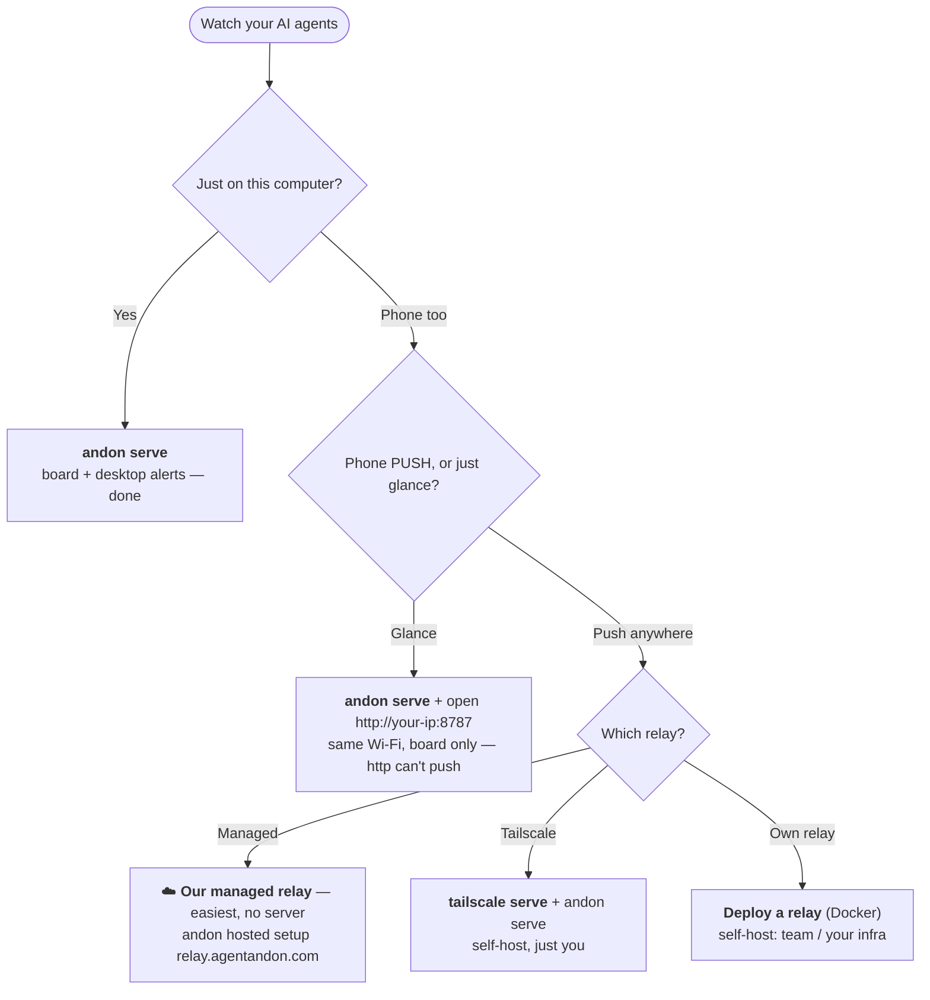

# 🚦 Agent Andon — a status board & notifier for Claude Code and Codex

**Glance at any screen — iPad, phone, or browser — or get a desktop alert — the moment your AI coding agent is working, needs you, done, or stuck.**

[](LICENSE)
[](https://nodejs.org)


Stand an old iPad on your desk — or open the board on your phone or any browser. Submit a task to
**Claude Code** or **OpenAI Codex**, then go do something else — one glance tells you whether the agent
is **working, needs you, done, or stuck**. No babysitting the terminal, no forgetting to come back.

It's a lightweight, self-hosted way to **monitor several AI coding agents at once** and **get notified
the instant one needs your approval, finishes its turn, or gets blocked** — on the board (any device),
a desktop banner, or your menu bar. No app, no account, zero dependencies.


> *Andon* (行灯) is the lean-manufacturing signal board: a light that tells the
> whole floor, at a glance, whether a line is running or needs a human. Same idea,
> for your agents.

- **Zero runtime dependencies** — pure Node.js standard library.
- **One command to wire up** — `andon install claude` edits your hooks for you (with a backup).
- **Multi-agent native** — one full-width row per session; whatever needs you floats to the top.
- **Speaks your language** — **English · 中文 · 日本語 · 한국어 · Español · Deutsch · Français**, auto-detected.
- **Any screen** — iPad, phone, or browser; no app, no account, no hardware.

<sub>中文用户：把闲置 iPad 立在桌边（或用手机/任意浏览器打开），变成 Claude Code / Codex 的"安灯"状态看板。提交任务后放心去干别的，一瞥就知道 agent 在跑 / 该你了 / 完成了 / 卡住了。</sub>

---

## Docs

New here? **[Install](#install)** → **[Quickstart](#quickstart-60-seconds)** → **[Which setup do you need?](#which-setup-do-you-need)**. Then, for depth:

| Guide | What's in it |
|---|---|
| **[Commands & event mapping](docs/commands.md)** | full CLI · Claude/Codex event→state · background-task counts · naming tiles |
| **[Notifications](docs/notifications.md)** | desktop alerts · menu bar · tuning approvals |
| **[Running it](docs/running.md)** | start / check / stop the board, **Tailscale Serve**, the relay |
| **[Configuration & security](docs/configuration.md)** | env vars · token auth · network model |
| **[Hosted board](docs/hosted.md)** · **[Deploying a relay](docs/deploy-relay.md)** | the "board from anywhere" relay — use it, or run one |
| **[Troubleshooting & FAQ](docs/troubleshooting.md)** · **[Developing](docs/develop.md)** | when something's off · contributing |

---

## How it works

```
Claude Code / Codex  ──(native hook)──▶  andon server (your computer)  ◀──(SSE push)──  iPad / phone / browser
```

1. **Detect** — each tool's native hook mechanism reports state changes. No change to your workflow.
2. **Relay** — a tiny HTTP server on your computer receives the events.
3. **Display** — the board holds an open SSE stream, so a state change shows in well under a second
   (it falls back to 1 s polling). A signal bar across the top is the "tower light," readable across the room.

State priority (the top bar and the row order take the most urgent one):
`stuck (red) > needs-you (amber) > done (green) > working (blue) > idle`.

**The board:** one full-width row per process; **stuck / needs-you** grow large, show their **full message**,
and float to the top (auto-scrolled into view), while *working / ready / idle* stay compact. Calm by default —
only the single most-urgent row pulses. One language per screen, auto-detected (override with the header
dropdown or `?lang=`).

---

## Install

```bash
npm install -g agent-andon      # or: npx agent-andon serve --demo
```

From source:

```bash
git clone https://github.com/tianshanghong/agent-andon && cd agent-andon
npm install && npm run build
node dist/cli.js serve --demo
```

> Requires Node.js ≥ 18.

---

## Quickstart (60 seconds)

**1. Verify the board with fake data:**

```bash
andon serve --demo
```

It prints a `http://<your-ip>:8787` URL. Open it on any phone, tablet, or browser — you should see two
rows cycling colors. Once it looks right, `Ctrl-C` and run for real:

```bash
andon serve
```

**2. Open the board** (iPad, phone, or any browser, same Wi-Fi as the computer):

- Open the printed URL. **It's `http://`, not `https://`.**
- Tap **"Enable sound"** once to unlock the chime (browsers mute audio until you tap; this is the board's
  in-browser sound, separate from the default-on desktop alerts). Remembered across reloads.
- On a phone/tablet: **Add to Home Screen** for a full-screen, address-bar-free board. (On a wall iPad,
  also set **Auto-Lock → Never**; the page requests a Wake Lock too.)

**3. Wire up your agents:**

```bash
andon install claude        # edits ~/.claude/settings.json (keeps a .andon-backup)
andon install codex         # edits ~/.codex/hooks.json    (keeps a .andon-backup)
andon doctor                # confirm everything's connected; reprints the board URL
```

Restart your Claude Code session and it lights up the board automatically. That's it.

> Want the board (and phone push) from **anywhere**, not just this Wi-Fi? → [**Which setup do you need?**](#which-setup-do-you-need)

---

## Which setup do you need?

`andon serve` already gives you the board + **desktop alerts on the computer running it** — free, zero
setup, on **macOS / Linux / Windows**. The part that takes more is **push to your phone**: a buzz when an
agent needs you, *phone locked, you away from the desk*. Phone push needs a relay reachable over **HTTPS**
+ **"Add to Home Screen"** on the phone (required on iPhone/iPad). **The easy way is our managed relay —
nothing to run, no Tailscale, no HTTPS to set up.**



| You want… | Do this |
|---|---|
| Board + **desktop alerts** on your computer | `andon serve` — the default *(macOS / Linux / Windows)*, alerts on |
| Glance at the board on a **phone/tablet on the same Wi-Fi** | `andon serve`, open `http://<your-ip>:8787` — *board only; `http` can't push* |
| **📱 Phone push — the easy way** *(no server, no Tailscale)* | **☁️ our managed relay:** `andon hosted setup https://relay.agentandon.com` + Add to Home Screen — *launching, [⭐ watch](https://github.com/tianshanghong/agent-andon)* |
| Phone push, **self-hosted — just you** | [`tailscale serve`](docs/running.md) + `andon serve` + Add to Home Screen |
| Phone push, **your own relay** (team / your infra) | [deploy a relay](docs/deploy-relay.md) (Docker) + Add to Home Screen |

**Rule of thumb:** `andon serve` gives **desktop** alerts for free, everywhere. Want them on your **phone**?
— easiest is our **managed relay** (nothing to run); or self-host with **Tailscale** (just you) or **your
own relay** (a team).

---

## Commands

```bash
andon serve                 # run the board (desktop alerts on by default)
andon install claude        # wire Claude Code hooks (also: install codex)
andon doctor                # health check + the board URL
andon post <state> <agent>  # push a status by hand
andon uninstall claude      # cleanly remove what Andon added
```

Full reference — every flag, the Claude/Codex **event → state** mapping, background-task counting, and
naming tiles — is in **[docs/commands.md](docs/commands.md)**.

---

## Notifications

Desktop alerts are **on by default** — a banner (and sound for needs-you / stuck) on the computer running
the server, degrading gracefully across macOS / Linux / Windows; there's also a menu-bar summary. Tune it
with `--say` / `--no-notify`, or pre-approve safe operations so amber fires less. See
**[docs/notifications.md](docs/notifications.md)**.

---

## Running it (start / stop)

```bash
andon serve                                  # foreground — Ctrl-C to stop
nohup andon serve > /tmp/andon.log 2>&1 &    # background (macOS / Linux)
pkill -f "cli.js serve"                      # stop a background one
```

Full start / check / stop for the board, **Tailscale Serve**, and the relay: **[docs/running.md](docs/running.md)**.

---

## Hosted ("board from anywhere")

Andon is local-first and **free to self-host forever** — that stays the default. The optional, **opt-in**
relay gives you the board + phone push from anywhere — use **our managed relay** (zero setup) or **run your
own** (same open-source code):

```bash
andon hosted setup https://relay.agentandon.com   # opt in — a key is generated that never leaves your machine
andon relay                                        # …or run the zero-knowledge relay yourself
andon verify <relay-url>                           # check a relay serves the exact open-source code
```

Every status is **end-to-end encrypted on your machine** before it leaves; the relay routes + stores
**ciphertext only** and can't read your prompts, code, titles, or messages — it sees only that you're
active, roughly when, and your IP. *"Verifiable, not just trusted":* the served code is open-source +
reproducible and `andon verify` confirms a relay serves exactly it. Full guides:
**[using the hosted board](docs/hosted.md)** · **[deploying a relay](docs/deploy-relay.md)**.

> **Don't want to run anything?** Our managed relay at `relay.agentandon.com` is the zero-setup path —
> it's **launching soon**; **⭐ star / watch** to catch the go-live.

---

## Security

By default the server binds `0.0.0.0` with **no auth** — fine on trusted home Wi-Fi, **not** on a
public/untrusted network. Set `ANDON_TOKEN` for a shared network, and don't port-forward it (use the HTTPS
paths above). The board only exposes high-level status — never code or logs. Details + env vars:
**[docs/configuration.md](docs/configuration.md)**.

---

## License

[AGPL-3.0-or-later](LICENSE) — © 2026 wwang.

Run, self-host, audit, fork, and modify Andon freely. If you run a **modified** version as a network
service, AGPL §13 asks you to offer its source to your users; running it unmodified (a wall board talking
to your own agents) carries no such obligation. The maintainer also offers Andon under separate
commercial terms for a hosted service — see [CONTRIBUTING](CONTRIBUTING.md) for how that stays possible.

The name **"Andon" / "Agent Andon"** and the logo are reserved marks of the author — the license covers
the code, not the name (see [TRADEMARK](TRADEMARK.md)). Forks must use a different name.
