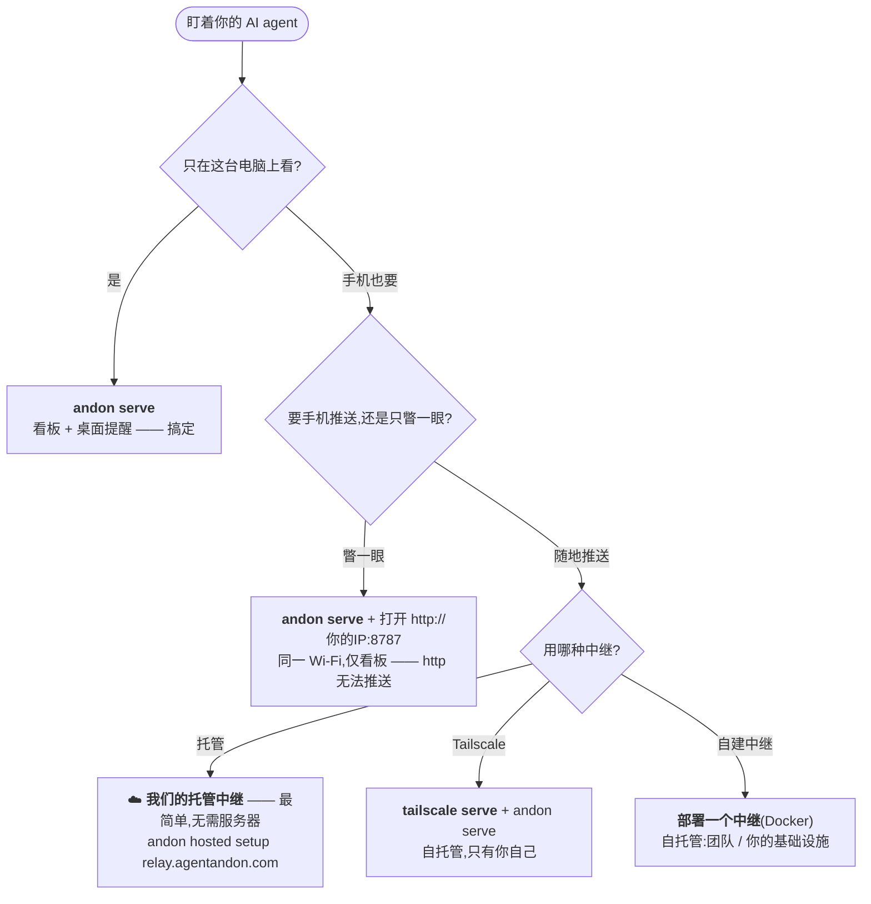

# 🚦 Agent Andon —— Claude Code 与 Codex 的状态看板和提醒

**在任意屏幕（iPad、手机或浏览器）一瞥，或收到桌面提醒 —— 第一时间知道你的 AI 编码 agent 是在运行、需要你、已完成，还是卡住了。**

[English](README.md) · **中文** · [日本語](README.ja.md) · [한국어](README.ko.md) · [Español](README.es.md) · [Deutsch](README.de.md) · [Français](README.fr.md)

[](LICENSE)
[](https://nodejs.org)


**⚡ 最快上手** —— 三条命令,就能随时随地用手机看你的 agent 跑到哪了。中继只经手密文、读不到你的代码,你的东西始终是你的:

```bash
npm i -g agent-andon
andon hosted setup https://relay.agentandon.com
andon install claude
```
*(随后重启你的 agent · 只想试试? `npx agent-andon serve --demo`)*

把一台闲置的 iPad 立在桌边 —— 或者直接用手机/任意浏览器打开看板。给 **Claude Code** 或
**OpenAI Codex** 提交一个任务，然后放心去干别的 —— 一瞥就知道 agent 是在 **运行、需要你、已完成，
还是卡住了**。不用守着终端，也不会忘了回来看。

这是一种轻量、自托管的方式,让你**同时盯着好几个 AI 编码 agent**,并在某个 agent **需要你批准、
结束了它这一轮、或者被卡住时第一时间得到提醒** —— 提醒可以来自看板(任意设备)、桌面横幅,或菜单栏。
无需 App、无需账号、零依赖。


> *行灯*(Andon)是精益生产里的信号看板:一盏灯,让整个车间一眼就能看出某条产线是在正常运转、
> 还是需要有人介入。同样的思路,这次是给你的 agent 用的。

- **零运行时依赖** —— 纯 Node.js 标准库。
- **一条命令接好** —— `andon install claude` 帮你改好 hook 配置(并保留备份)。
- **原生支持多 agent** —— 每个会话一整行;谁需要你,谁就浮到最上面。
- **会说你的语言** —— **English · 中文 · 日本語 · 한국어 · Español · Deutsch · Français**,自动识别。
- **任意屏幕** —— iPad、手机或浏览器;无需 App、账号或额外硬件。

---

## 文档

第一次用?**[安装](#安装)** → **[60 秒快速上手](#快速上手60-秒)** → **[我该用哪种方案?](#我该用哪种方案)**。
想深入了解再看下面这些(文档目前为英文):

| 指南 | 内容 |
|---|---|
| **[命令与事件映射](docs/commands.md)** | 完整 CLI · Claude/Codex 事件→状态 · 后台任务计数 · 给卡片命名 |
| **[通知](docs/notifications.md)** | 桌面提醒 · 菜单栏 · 调整批准策略 |
| **[运行它](docs/running.md)** | 启动 / 检查 / 停止看板、**Tailscale Serve**、中继 |
| **[配置与安全](docs/configuration.md)** | 环境变量 · token 鉴权 · 网络模型 |
| **[托管看板](docs/hosted.md)** · **[部署中继](docs/deploy-relay.md)** | “随时随地的看板”中继 —— 用它,或自己跑一个 |
| **[排错与 FAQ](docs/troubleshooting.md)** · **[开发](docs/develop.md)** | 出问题时 · 如何贡献 |

---

## 工作原理

```
Claude Code / Codex  ──(原生 hook)──▶  andon 服务(你的电脑)  ◀──(SSE 推送)──  iPad / 手机 / 浏览器
```

1. **检测** —— 每个工具自带的 hook 机制上报状态变化。不改变你的工作流。
2. **中转** —— 你电脑上一个极小的 HTTP 服务接收这些事件。
3. **展示** —— 看板保持一条常开的 SSE 流,状态变化在一秒内就能显示出来(失败时退回到 1 秒轮询)。
   顶部那条信号条就是“信号塔灯”,隔着房间也看得清。

状态优先级(顶部信号条和行的排序都取最紧急的那个):
`卡住(红) > 需要你(琥珀) > 完成(绿) > 运行中(蓝) > 空闲`。

**看板本身:**每个进程占一整行;**卡住 / 需要你**会变大、显示**完整信息**并浮到顶部(自动滚动到可见处),
而*运行中 / 已就绪 / 空闲*保持紧凑。默认很安静 —— 只有最紧急的那一行会脉动。每块屏幕一种语言,
自动识别(可用顶部下拉框或 `?lang=` 覆盖)。

---

## 安装

```bash
npm install -g agent-andon      # 或:npx agent-andon serve --demo
```

从源码安装:

```bash
git clone https://github.com/tianshanghong/agent-andon && cd agent-andon
npm install && npm run build
node dist/cli.js serve --demo
```

> 需要 Node.js ≥ 18。

---

## 快速上手(60 秒)

**1. 用假数据验证看板:**

```bash
andon serve --demo
```

它会打印一个 `http://<你的IP>:8787` 的网址。在任意手机、平板或浏览器打开 —— 你应该看到两行卡片在
循环变色。看起来没问题就 `Ctrl-C`,然后正式运行:

```bash
andon serve
```

**2. 打开看板**(iPad、手机或任意浏览器,和电脑在同一 Wi-Fi):

- 打开刚才打印的网址。**是 `http://`,不是 `https://`。**
- 点一次 **“Enable sound”** 解锁提示音(浏览器在你点击前会静音;这是看板的浏览器内置声音,
  和默认开启的桌面提醒是两回事)。刷新后依然记住。
- 在手机/平板上:**添加到主屏幕**,得到一个全屏、没有地址栏的看板。(挂在墙上的 iPad 还要把
  **自动锁定 → 永不**;页面也会主动请求 Wake Lock 保持常亮。)

**3. 接上你的 agent:**

```bash
andon install claude        # 修改 ~/.claude/settings.json(保留 .andon-backup)
andon install codex         # 修改 ~/.codex/hooks.json   (保留 .andon-backup)
andon doctor                # 确认都连上了;再打印一次看板网址
```

重启你的 Claude Code 会话,它就会自动点亮看板。就这样。

> 想从**任何地方**(而不只是这个 Wi-Fi)用看板(以及手机推送)?→ [**我该用哪种方案?**](#我该用哪种方案)

---

## 我该用哪种方案?

`andon serve` 本身就已经给了你看板 + **运行它的那台电脑上的桌面提醒** —— 免费、零配置,
**macOS / Linux / Windows** 都行。更费点事的是**推送到你的手机**:在你离开桌面、手机锁屏时,
某个 agent 需要你就嗡一下。手机推送需要一个能通过 **HTTPS** 访问的中继,并且要在手机上
**“添加到主屏幕”**(iPhone/iPad 上是必须的)。**最省事的办法是用我们的托管中继 —— 不用自己跑任何东西、
不用 Tailscale、也不用自己配 HTTPS。**



| 你想要…… | 这样做 |
|---|---|
| 在你电脑上看板 + **桌面提醒** | `andon serve` —— 默认方案 *(macOS / Linux / Windows)*,提醒已开 |
| 在**同一 Wi-Fi 的手机/平板**上瞥一眼看板 | `andon serve`,打开 `http://<你的IP>:8787` —— *仅看板;`http` 无法推送* |
| **📱 手机推送 —— 最省事** *(无需服务器、无需 Tailscale)* | **☁️ 我们的托管中继:** `andon hosted setup https://relay.agentandon.com` + 添加到主屏幕 —— *即将上线,[⭐ 关注](https://github.com/tianshanghong/agent-andon)* |
| 手机推送,**自托管 —— 只有你自己** | [`tailscale serve`](docs/running.md) + `andon serve` + 添加到主屏幕 |
| 手机推送,**你自己的中继**(团队 / 自有基础设施) | [部署一个中继](docs/deploy-relay.md)(Docker) + 添加到主屏幕 |

**经验法则:** `andon serve` 在哪儿都免费给你**桌面**提醒。想要推到**手机**上?
—— 最省事是用我们的**托管中继**(什么都不用跑);或者用 **Tailscale** 自托管(只有你自己),
或者跑**你自己的中继**(适合团队)。

---

## 命令

```bash
andon serve                 # 运行看板(默认开启桌面提醒)
andon install claude        # 接上 Claude Code 的 hook(也有:install codex)
andon doctor                # 健康检查 + 看板网址
andon post <state> <agent>  # 手动推送一个状态
andon uninstall claude      # 干净地移除 Andon 添加的东西
```

完整参考 —— 每个参数、Claude/Codex 的**事件 → 状态**映射、后台任务计数、给卡片命名 ——
都在 **[docs/commands.md](docs/commands.md)**(英文)。

---

## 通知

桌面提醒**默认开启** —— 在运行服务的那台电脑上弹出横幅(需要你 / 卡住时还会响),
在 macOS / Linux / Windows 上都能优雅降级;还有一个菜单栏摘要。可以用 `--say` / `--no-notify` 调整,
或者预先批准安全操作,让琥珀色少触发一些。详见 **[docs/notifications.md](docs/notifications.md)**(英文)。

---

## 运行它(启动 / 停止)

```bash
andon serve                                  # 前台 —— Ctrl-C 停止
nohup andon serve > /tmp/andon.log 2>&1 &    # 后台(macOS / Linux)
pkill -f "cli.js serve"                      # 停止一个后台实例
```

看板、**Tailscale Serve** 和中继的完整启动 / 检查 / 停止方法:**[docs/running.md](docs/running.md)**(英文)。

---

## 托管(“随时随地的看板”)

Andon 以本地优先,而且**永远可以免费自托管** —— 这始终是默认。可选的、**需要你主动开启**的中继,
能让你从任何地方用看板 + 手机推送 —— 可以用**我们的托管中继**(零配置),也可以**自己跑一个**
(同一份开源代码):

```bash
andon hosted setup https://relay.agentandon.com   # 开启 —— 会生成一把永远不离开你机器的密钥
andon relay                                        # …… 或者自己跑这个读不到内容的中继
andon verify <relay-url>                           # 检查某个中继跑的是不是这份开源代码
```

每条状态的**内容(标题、消息、agent 名称)在离开你的机器前就已在本机端到端加密**;中继只转发并存储
**这段它无法解密的密文**(密钥永不上传),因此读不到你的提示词、代码、标题或消息。它只能看到粗粒度的
元数据:你是否活跃、大致时间、概要状态,以及你的 IP。
*“可验证,而不只是信任”:* 提供出去的代码是开源且可复现的,`andon verify` 能确认某个中继跑的
正是这份代码。完整指南:**[使用托管看板](docs/hosted.md)** · **[部署中继](docs/deploy-relay.md)**(英文)。

> **什么都不想跑?** 我们位于 `relay.agentandon.com` 的托管中继就是那条零配置的路 ——
> **即将上线**;**⭐ star / watch** 一下,上线第一时间知道。

---

## 安全

默认情况下,服务绑定在 `0.0.0.0` 且**无鉴权** —— 在可信的家庭 Wi-Fi 上没问题,
但**不要**放在公网/不可信网络上。共享网络请设置 `ANDON_TOKEN`,也不要把它做端口转发(请用上面那些
HTTPS 方案)。看板只暴露高层级的状态 —— 永远不含代码或日志。细节 + 环境变量:
**[docs/configuration.md](docs/configuration.md)**(英文)。

---

## 许可证

[AGPL-3.0-or-later](LICENSE) —— © 2026 wwang。

你可以自由地运行、自托管、审计、fork 和修改 Andon。如果你把**修改过**的版本作为网络服务运行,
AGPL 第 13 条要求你向你的用户提供其源码;原样运行(一块连着你自己 agent 的墙上看板)则没有这项义务。
维护者另外也以单独的商业条款提供 Andon 用于托管服务 —— 这是如何保持可能的,见
[CONTRIBUTING](CONTRIBUTING.md)。

**“Andon” / “Agent Andon”** 这个名称及其 logo 是作者保留的标识 —— 许可证覆盖的是代码,而非名称
(见 [TRADEMARK](TRADEMARK.md))。Fork 必须使用不同的名字。
